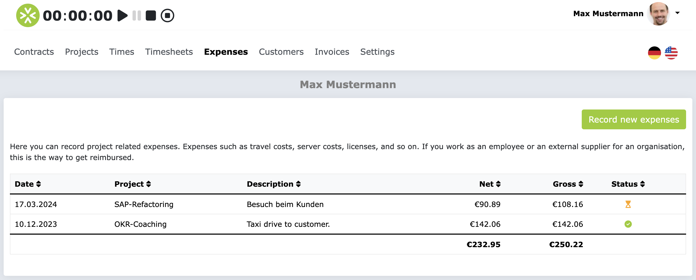
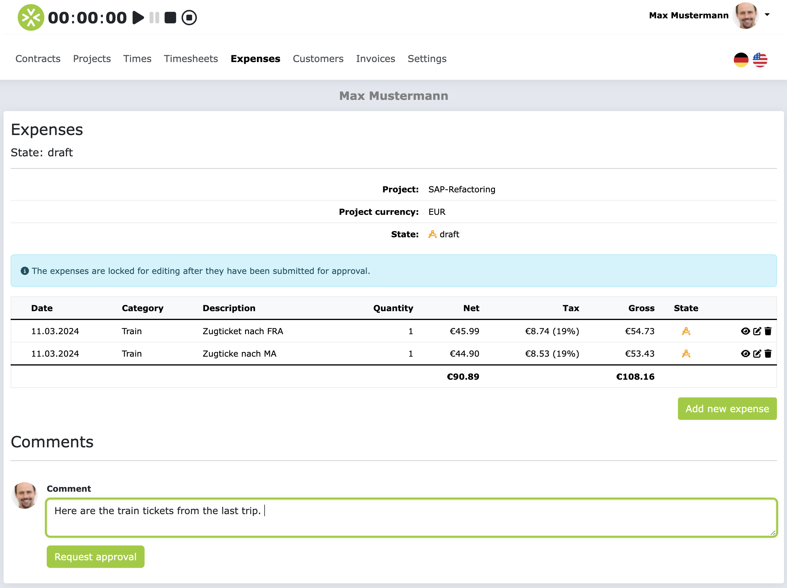

# Expenses 

In this section you will learn how you can record and manage expenses in ZEIT.IO. 
Expenses here mean all project-related costs, excluding project times. These can be, for example, travel costs, 
expenses, but also material costs. In most cases these are travel costs.

Each expense must be assigned to a project. In order for you to be able to record an expense for a project, 
there must also be a budget for expenses in the project and the budget must not yet be used up.

!!! Info
    If you work as a freelancer in an organizational project, you must first have your expenses approved 
    before you can receive credit note for them. You can find out how to get expenses approved further down the 
    page.

## Record expenses

Click on “Expenses” in the main menu to go to the expenses overview page. Here you can see all your previously 
recorded expenses. If you haven't recorded any expenses yet, the list will be empty.

Click on the “Record new expenses” button to create a new expense. The form then looks like this:

First of all, select the right project to which you want to post the expenses. 
Please only record one expense in the form. Each expense should be a single item. No collection positions! 
If you have multiple expenses, please enter a separate item for each expense.

!!! Warning
    Please make sure that you record the expenses correctly. Above all, make sure you provide the correct currency, 
    date and tax rate. Incorrect information could result in the expense not being approved and you not receiving 
    a credit note.

Please always upload the receipt that proves the expense. The file attachment is not mandatory, but a missing  
receipt may result in the expense being rejected.

!!! Info
    The checkbox for input tax is also very important. This indicates whether you are **entitled to deduct input tax** 
    in the country in which the expense was incurred. If you are not sure whether you are entitled to deduct input tax, 
    please ask your tax advisor.

If you are **entitled to deduct input tax**, then you can deduct the input tax included in the expense from your
Reclaim the tax office. If you are not **entitled to deduct input tax**, then you cannot reclaim the input tax. 
Depending on whether you are **entitled to deduct input tax** or not, the credit for the approved expenses will then 
be created either with the net total or with the gross total of the individual items.

Once you have filled out the form, click on the “Save” button. The output is then saved
and you will come to a page that looks something like this:

On this page you can see the first position of your issue. If you have multiple positions, you can add additional 
positions here. To do this, click on the “Add new issue” button. This will open the form for recording expenses again 
and you can enter another item.

## Get expenses approved

After you have recorded your expenses, you can submit them for approval. To do this, click on the “Request approval” 
button on the page where you have recorded all your expenses.

This creates an approval request for the expenses recorded and the people who are added as approvers for expenses in 
the project are informed by email about the new approval request and can then comment on, approve or reject it. 
The approvers will then check whether the expenses were recorded correctly and whether the receipts were uploaded correctly. 
You will then be notified by email once the approval application has been processed.

!!! info
    If you participate in the crediting process, immediately after the expenses are approved, a credit note will be 
    created for the approved expenses and sent to your primary email address. If you have any questions about the 
    credit note process, please read the [FAQ section in the credit note process](/freelancer/credit process/#faqs).

After submitting the approval request, you can no longer edit or delete the expenses.

## FAQs

### Why can't I edit or delete my submitted expenses?

As long as the expenses are in the state `pending for approval`, they can no longer be edited or deleted.
If the expenses are rejected, you can edit or correct the expenses again and resubmit them for approval.

### Why can't I record expenses?

If you are unable to record expenses, it may be because none of your projects have a budget for expenses, 
or the budget for expenses has already been used up.

### Why do I see all expenses displayed in EUR even though I recorded them in a different currency?

You can record expenses in 33 different currencies. The expenses are then converted into the target currency 
of the project in real time. This means that in the expense overview you can see all items in the target 
currency of the project.
