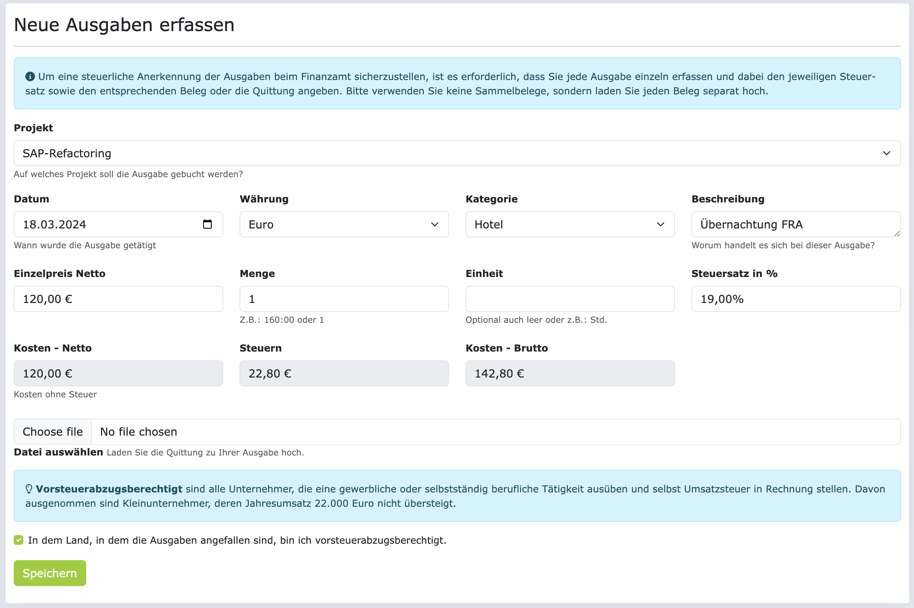
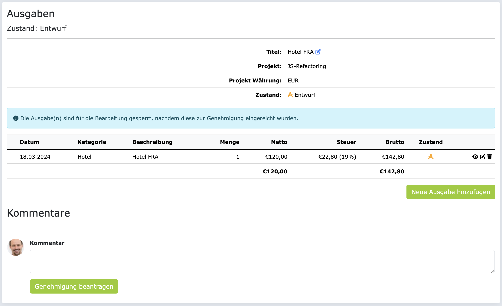

# Ausgaben (Reisekosten & Spesen)

In diesem Abschnitt erfahren Sie, wie Sie Ausgaben in ZEIT.IO erfassen und verwalten können. Mit Ausgaben sind
hier alle projektbezogenen Kosten ausser den Projektzeiten gemeint. Das können z.B. Reisekosten, Spesen,
aber auch Materialkosten sein. In den meisten Fällen handelt es sich um Reisekosten und Spesen.

Jede Ausgabe muss einem Projekt zugeordnet werden. Damit Sie eine Ausgabe zu einem Projekt erfassen können,
muss in dem Projekt auch ein Budget für Ausgaben hinterlegt sein, und dieses darf noch nicht aufgebraucht sein.

!!! Info
    Wenn Sie als Freiberufler in einem Orga-Projekt arbeiten, dann müssen Sie
    Ihre Ausgaben/Spesen erst genehmigen lassen, bevor Sie dafür eine Gutschrift erhalten können.
    Wie Sie Ausgaben/Spesen genehmigen lassen, erfahren Sie weiter unten auf der Seite.

## Ausgaben erfassen

Klicken Sie im Hauptmenü auf "Ausgaben", um auf die Ausgaben-Übersichtsseite zu gelangen. Hier sehen Sie alle
Ihre bisher erfassten Ausgaben. Wenn Sie noch keine Ausgaben erfasst haben, dann ist die Liste leer.

Für eine neue Ausgabe klicken Sie auf den Button "Neue Ausgabe erfassen". Das Formular dazu sieht
so aus:

Wählen Sie zuerst das richtige Projekt aus, auf das Sie die Ausgaben buchen wollen. 
Jede Ausgabe sollte eine einzelne Position sein, erfassen Sie in dem Formular deshalb bitte immer nur genau
eine Position, und keine Sammelpositionen.

!!! Warning 
    Achten Sie bitte darauf, dass Sie die Ausgaben korrekt erfassen, vor allem, dass Sie die richtige Währung, 
    das richtige Datum und den korrekten Steuersatz angeben Falsche Angaben können dazu führen, dass die
    Ausgaben nicht genehmigt werden und Sie keine Gutschrift erhalten.

Laden Sie bitte auch immer den Beleg hoch, der die Ausgabe belegt. Der Datei-Anhang ist keine Pflicht, aber 
wenn Sie den Beleg nicht hochladen, dann kann das dazu führen, dass die Ausgabe abgelehnt wird.

!!! Info
    Sehr wichtig ist auch die Checkbox für die Vorsteuer. Damit geben Sie an, ob Sie in dem Land, in dem die 
    Ausgabe angefallen ist, **vorsteuerabzugsberechtigt** sind. Wenn Sie nicht sicher sind, fragen Sie bitte
    Ihren Steuerberater.

Wenn Sie **Vorsteuerabzugsberechtigt** sind, dann können Sie die Vorsteuer, die in der Ausgabe enthalten ist, von Ihrem 
Finanzamt zurückfordern. Wenn Sie nicht **Vorsteuerabzugsberechtigt** sind, dann können Sie die Vorsteuer nicht zurückfordern.
Abhängig davon, ob Sie **Vorsteuerabzugsberechtigt** sind oder nicht, wird die Gutschrift für die genehmigten Ausgaben dann
entweder mit der Netto-Summe oder mit der Brutto-Summe der einzelen Positionen erstellt.

Wenn Sie das Formular ausgefüllt haben, dann klicken Sie auf den Button "Speichern". Die Ausgabe wird gespeichert
und Sie kommen auf eine Seite die ungefähr so aussieht:

Auf dieser Seite sehen Sie die erste Position ihrer Ausgabe. Wenn Sie mehrere haben, können Sie diese hier hinzufügen.
Durch klicken auf "Neue Ausgabe hinzufügen"öffent sich wieder das Formular für die Erfassung.

## Ausgaben genehmigen lassen

Nachdem Sie Ihre Ausgaben/Spesen erfasst haben, können Sie diese zur Genehmigung einreichen.
Dafür klicken Sie auf der Erfassungs-Seite auf den Button "Genehmigung beantragen".

Es wird ein Genehmigungsantrag für die Ausgaben/Spesen erstellt, die hinterlegten Genehmiger werden per E-Mail
über den neuen Antrag informiert und können ihn kommentieren, genehmigen oder ablehnen. Dazu wird geprüft,
ob die Ausgaben korrekt erfasst und die Belege korrekt hochgeladen wurden. Sie werden dann per E-Mail 
benachrichtigt, sobald der Genehmigungsantrag bearbeitet wurde.

!!! Info
    Sofern Sie am Gutschriftverfahren teilnehmen, wird direkt nach der Genehmigung der
    Ausgaben eine Gutschrift für die genehmigten Ausgaben erstellt und an Ihre primäre
    E-Mail-Adresse verschickt. Wenn Sie Fragen zum Gutschritverfahren haben, dann lesen Sie
    sich bitte den [FAQ-Abschnitt im Gutschriftverfahren](/freiberufler/gutschriftverfahren/#faqs) durch.

Nach der Einreichung des Genehmigungsantrags können Sie die Ausgaben/Spesen nicht mehr bearbeiten oder löschen.

## FAQs

### Wieso kann ich meine eingereichten Ausgaben/Spesen nicht bearbeiten oder löschen?

Solange die Ausgaben/Spesen zur Genehmigung eingereicht sind, können diese nicht mehr bearbeitet oder gelöscht werden.
Wenn die Ausgaben/Spesen abgelehnt werden, können Sie die Ausgaben/Spesen wieder bearbeiten, bzw. korrigieren, und 
erneut zur Genehmigung einreichen.

### Wieso kann ich keine Ausgaben/Spesen erfassen?

Wenn Sie keine Ausgaben/Spesen erfassen können,  kann das daran liegen, dass keines Ihrer Projekte ein Budget für
Ausgaben hat, oder dass das Budget für Ausgaben bereits aufgebraucht ist. 

### Wieso bekomme ich alle Ausgaben in EUR angezeigt, obwohl ich in einer anderen Währung erfasst habe?

Sie können Ausgaben in 33 verschiedenen Währungen erfassen. Die Ausgaben werden dann in Echtzeit in die 
Zielwährung des Projektes umgerechnet. Das bedeutet, dass Sie in der Ausgaben-Übersicht alle Positionen 
in der Zielwährung des Projektes sehen. 
