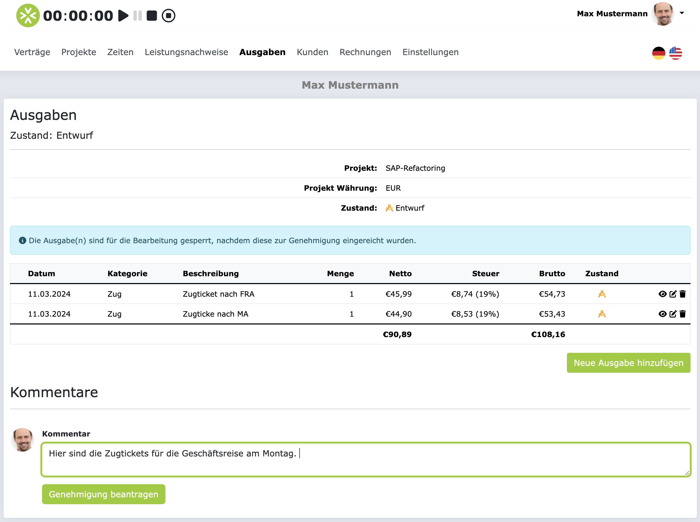

# Ausgaben und Spesen

In diesem Abschnitt erfahren Sie, wie Sie Ausgaben und Spesen in ZEIT.IO erfassen und verwalten können.

## Ausgaben/Spesen genehmigen lassen

Nachdem Sie Ihre Ausgaben/Spesen erfasst haben, können Sie diese zur Genehmigung einreichen.
Dafür klicken Sie auf der Seite, auf der Sie alle Ihre Ausgaben erfasst haben, auf den Button "Genehmigung beantragen".

Damit wird ein Genehmigungsantrag für die Ausgaben/Spesen erstellt und die Personen die im Projekt als Genehmiger
für Ausgaben/Spesen hinterlegt sind, werden per E-Mail über den neuen Genehmigungsantrag informiert und können ihn dann
kommentieren, genehmigen oder ablehnen. Die Genehmiger werden dann prüfen, ob die Ausgaben korrekt erfasst wurden und
ob die Belege korrekt hochgeladen wurden. Sie werden dann per E-Mail benachrichtigt, sobald der Genehmigungsantrag
bearbeitet wurde.

!!! Info
    Sofern Sie am Gutschriftverfahren teilnehmen, wird direkt nach der Genehmigung der
    Ausgaben, eine Gutschrift für die genehmigten Ausgaben erstellt und an ihre primäre
    E-Mail-Adresse verschickt. Wenn Sie Fragen zum Gutschritverfahren haben, dann lesen Sie
    sich bitte den [FAQ-Abschnitt im Gutschriftverfahren](/freiberufler/gutschriftverfahren/#faqs) durch.

Nach der Einreichung des Genehmigungsantrags können Sie die Ausgaben/Spesen nicht mehr bearbeiten oder löschen.

## FAQs

### Wieso kann ich meine eingereichten Ausgaben/Spesen nicht bearbeiten oder löschen?

Solange die Ausgaben/Spesen zur Genehmigung eingereicht sind, können diese nicht mehr bearbeitet oder gelöscht werden.
Wenn die Ausgaben/Spesen abgelehnt werden, dann können Sie die Ausgaben/Spesen wieder bearbeiten, bzw. korrigieren,
und erneut zur Genehmigung einreichen.
