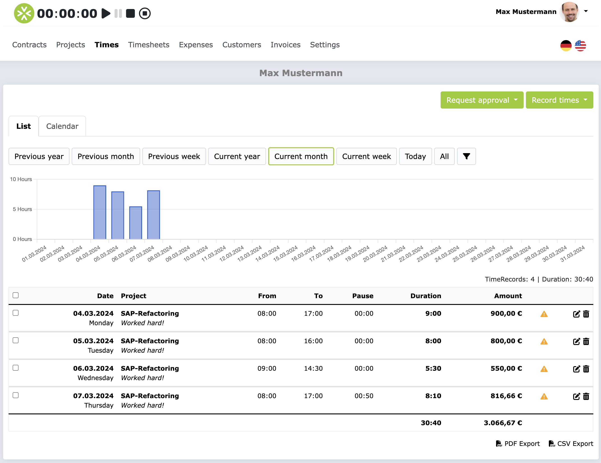
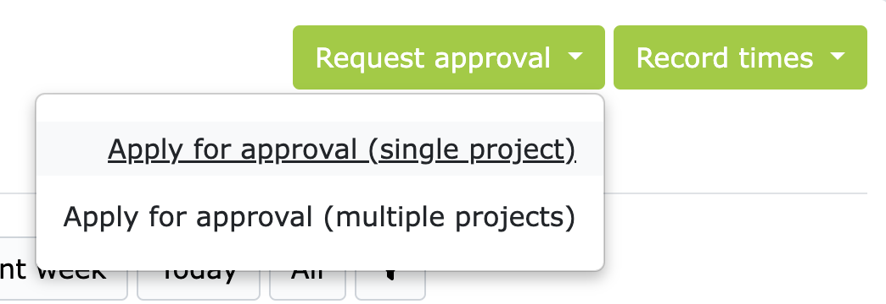
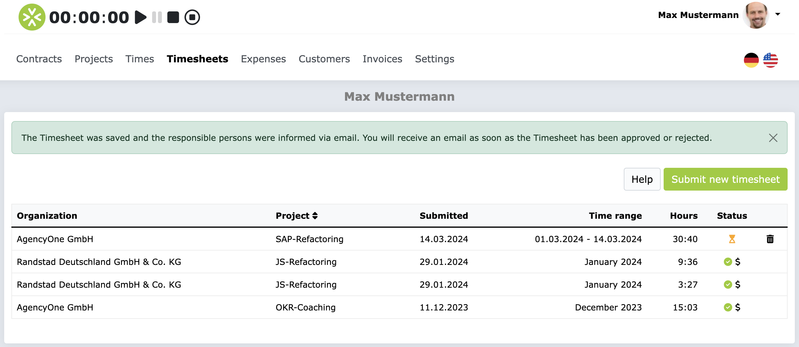
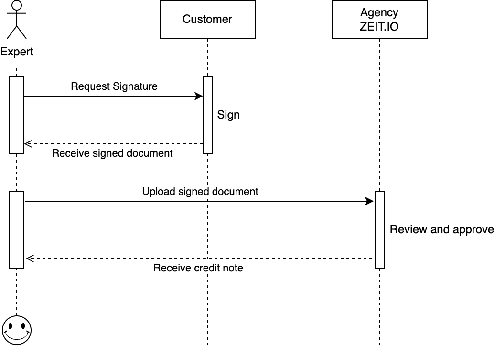
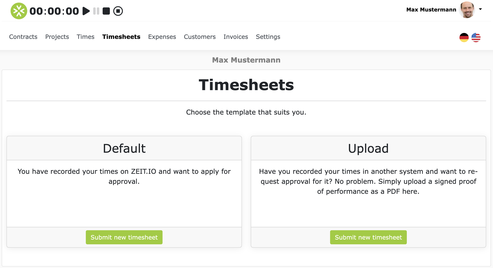
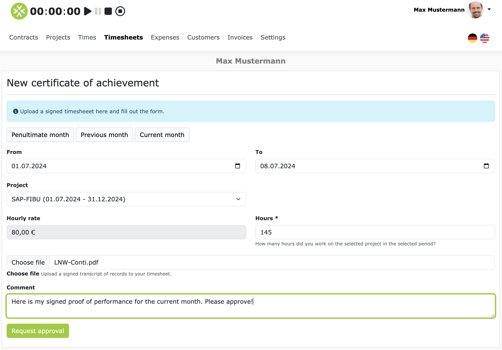

# Proof of performance 

Proof of performance is used to get approvals for:

- Times you have recorded directly on ZEIT.IO.
- Times you have imported into ZEIT.IO.
- Times you have recorded outside of ZEIT.IO.
- Fixed price packages you have completed.

In the first two cases, a proof of performance is always a collection of booked times (TimeRecords) in a specific period of time,
related to at least one project and a single person.

## Get times approved (TimeRecords)

This chapter covers the approval process for times that you have recorded directly on ZEIT.IO, or imported into ZEIT.IO. 
This applies to all time bookings (TimeRecords) that can be found in the main menu under "Times". 
This also includes, for example, time bookings (Time Records) that were imported via the JIRA Tempo CSV import and the JIRA Clockwork CSV import. 

If you click on "Times" in the main menu, you will see your most recent bookings in the "List" tab. 
Bookings that have already been approved are marked with a green check mark. 
Bookings that still need to be approved are marked with a yellow warning symbol. 
As you can see here, in the second to last column of the table, to the right of the amount: 

 

As long as the bookings have not yet been approved, you can still edit and delete them. 
When you have completed your time tracking for a certain period, you can submit the bookings for approval. 
To do this, simply click on the green button "Request approval" at the top right.

You can request approval for a single project, or for several projects at the same time.
In most cases, you need the first option. Unless your contact person in the project says otherwise, you should always choose the first option.

On the next page, you can select a period and a project for which you want to request approval. 
The previous month is preselected by default. 
However, you can also set the current month with one click using the "convenient" buttons. 
The table below then shows all bookings from the selected period and project that have not yet been approved.

At the very bottom of the page, you can optionally enter a comment, e.g. to point something out to the approver. 
By clicking on "Request approval", approval is then requested. 
In the background, a new proof of performance record is created, which contains the time bookings (TimeRecords) from the selected period and project. 
If everything worked, you will see a confirmation message and the open proof of performance record.

Users who are registered in the project as approvers for time bookings will be informed by email about the new performance record and can then comment on it, approve it or reject it. 
You will be notified by email as soon as the performance record has been processed.

As long as the time records are on the proof of performance to be approved, they cannot be edited or deleted. 
If the proof of performance is rejected, the time records are released for editing again so that you have the opportunity to correct the time records and resubmit them for approval. 
If the proof of performance has been approved, the time records on it remain permanently blocked for editing and are therefore unchangeable. 

!!! Info 
    If you participate in the credit note process, a credit note for the approved times will be created immediately after the proof of performance has been approved and sent to your primary email address. 
    If you have any questions about the credit note process, please read the [FAQ section in the credit note process](/freiberufler/gutschriftverfahren.en/#faqs). 

If you do not participate in the credit note process, you can create an invoice for the approved times directly in ZEIT.IO. 
To do this, click on "Invoices" in the main menu and then, in the timesheet template, on "Create new invoice". 
You can then select the approved proof of performance and an invoice will automatically be created for it.

## Have external proof of performance approved

Sometimes you also have to have times approved that you have recorded outside of ZEIT.IO.
If the end customer insists that you have to record the times in their system, then you can still submit the times to ZEIT.IO for approval.
To do this, you have to export your booked times from the other system and usually have the customer sign it.
We call this signed document the LNW (proof of performance).

In ZEIT.IO you can then upload your LNW as a PDF and submit it to the agency for approval.
The agency you are working with will check the LNW again and can then finally approve or reject it.
If the agency approves the LNW and you participate in the credit note process, then a credit note for the approved services will automatically be issued and sent to you.
You then no longer have to write an invoice.
The process for this looks like this:

If you have a signed LNW and want to upload it, click on "Proof of performance" in the main menu and then on "Submit new proof of performance".
On the next page you have various options.
Please select the "Upload" option here.

On the next page you can then upload the LNW, assign it to a project, enter the number of hours and optionally add a comment.
By clicking on "Apply for approval" the LNW is then submitted for approval.

Users who are registered as approvers in the project will be informed by email about the new proof of performance and can then comment on it, approve it or reject it.
The approvers will then check whether the information on the form matches the information in the PDF and whether the LNW is correctly signed.

You will then be notified by email as soon as the proof of performance has been processed.

!!! Info
    If you participate in the credit note process, a credit note for the approved services will be created immediately after the proof of performance has been approved and sent to your primary email address.
    If you have any questions about the credit note process, please read the [FAQ section in the credit note process](/freiberufler/gutschriftverfahren.en/#faqs).

## FAQs

### Why can't I edit or delete the times I have submitted?

As long as the time recordings (TimeRecords) are on a performance record that is to be approved, they cannot be edited or deleted.
If the performance record is rejected, the time recordings (TimeRecords) are released for editing again so that you have the opportunity to correct the time recordings (TimeRecords) and resubmit them for approval.

### How can I edit or delete a performance record (LNW)?

You cannot delete a submitted performance record! As long as the performance record has not yet been approved, you can delete it.
By deleting it, you withdraw the performance record and the time recordings (TimeRecords) are released for editing again.
