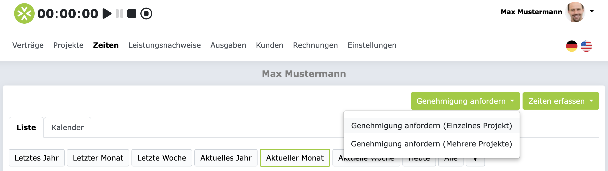
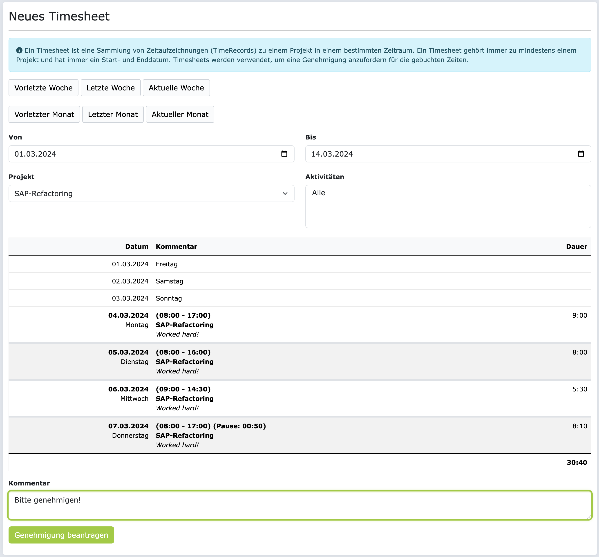
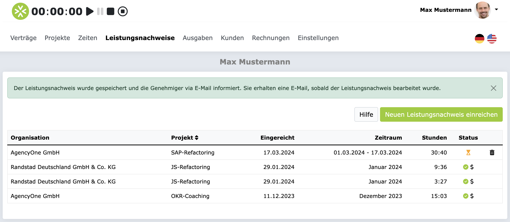
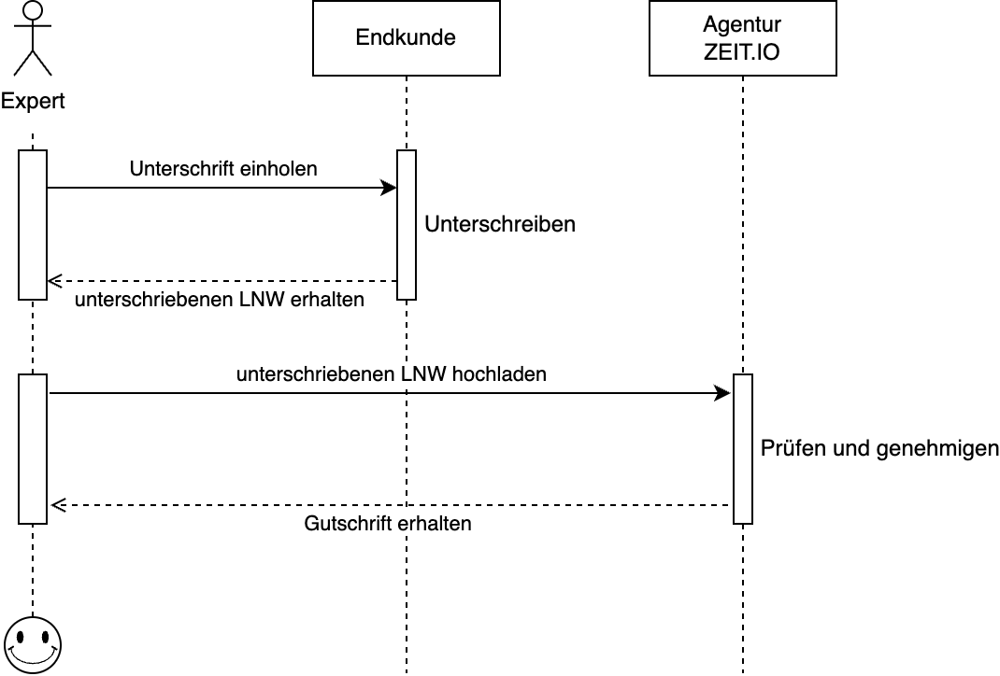
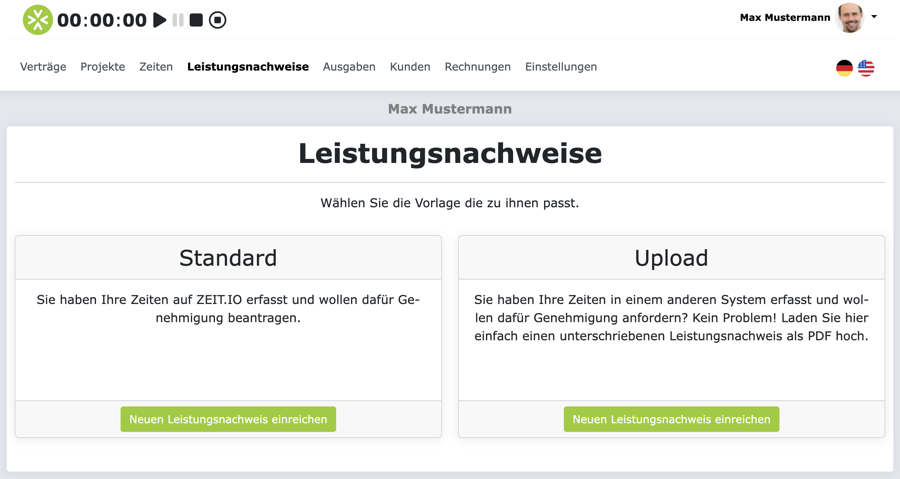
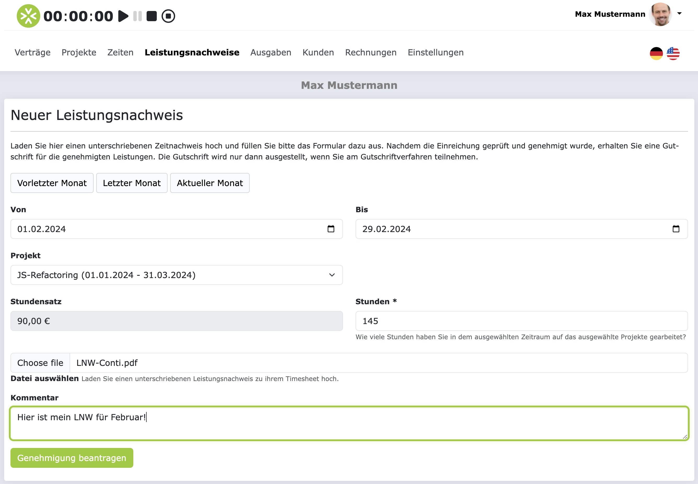

# Leistungsnachweise

Leistungsnachweise werden verwendet, um Genehmigungen für gebuchte Zeiten anzufordern.
Ein Leistungsnachweis ist immer eine Sammlung von gebuchten Zeiten (TimeRecords) in einem bestimmten Zeitraum,
bezogen auf mindestens ein Projekt und eine einzelne Person.

## Zeiten genehmigen lassen (TimeRecords)

Dieses Kapitel behandelt das Genehmigungsverfahren für Zeiten, die Sie direkt auf ZEIT.IO erfasst haben,
bzw. nach ZEIT.IO importiert haben. Das betrifft alle Zeitbuchungen (TimeRecords) die im Hauptmenü unter "Zeiten"
zu finden sind. Dies beinhaltet z.B. auch Zeitbuchungen (Time Records), die über den JIRA Tempo CSV Import und den
JIRA Clockwork CSV Import importiert wurden.

Wenn Sie im Hauptmenü auf "Zeiten" klicken, dann sehen Sie im Tab "Liste" Ihre letzten Buchungen.
Buchungen, die bereits genehmigt wurden, sind mit einem grünen Haken markiert. Buchungen die noch
genehmigt werden müssen, sind mit einem gelben Warnsymbol versehen. Wie hier zu sehen, in der
vorletzten Spalte der Tabelle, rechts vom Betrag:

Solange die Buchungen noch nicht genehmigt sind, können Sie sie noch bearbeiten und löschen.
Wenn Sie Ihre Zeiterfassung für einen bestimmten Zeitraum abgeschlossen haben, dann können Sie
die Buchungen zur Genehmigung einreichen. Dafür klicken Sie ganz einfach auf den grünen Button
"Genehmigung anfordern", rechts oben.

Sie können Genehmigung für ein einzelnes Projekt anfordern, oder für mehrere Projekte gleichzeitig.
In den meisten Fällen brauchen Sie die erste Option. Sofern Ihr Ansprechpartner im Projekt nicht
etwas anderes sagt, sollten Sie immer die erste Option wählen.

Auf der nächsten Seite können Sie einen Zeitraum und ein Projekt auswählen, für das Sie die Genehmigung
anfordern wollen. Standardmäßig ist der Vormonat vorausgewählt. Sie können aber über die "convenient" Buttons
auch mit einem Klick den aktuellen Monat setzen. In der untenstehenden Tabelle werden dann alle Buchungen
angezeigt, aus dem gewählten Zeitraum und Projekt, die noch nicht genehmigt sind.

Ganz unten auf der Seite, können Sie optional noch einen Kommentar eingeben, z.B. um den Genehmiger auf
etwas hinzuweisen. Mit dem Klick auf "Genehmigung beantragen" wird die Genehmigung dann beantragt. Im Hintergrund
wird dadurch ein neuer Leistungsnachweis erstellt, welcher die Zeitbuchungen (TimeRecords) aus dem
gewählten Zeitraum und Projekt enthält. Wenn alles geklappt hat, dann sehen Sie eine Bestätigungsmeldung
und den offenen Leistungsnachweis.

Die Personen die im Projekt als Genehmiger für Zeitbuchungen hinterlegt sind, werden per E-Mail über den neuen
Leistungsnachweis informiert und können es dann kommentieren, genehmigen oder ablehnen. Sie werden dann per
E-Mail benachrichtigt, sobald der Leistungsnachweis bearbeitet wurde.

Solange die Zeitbuchungen (TimeRecords) sich auf dem zu genehmigenden Leistungsnachweis befinden, können diese
nicht bearbeitet oder gelöscht werden. Wenn der Leistungsnachweis abgelehnt wird, dann werden die
Zeitbuchungen (TimeRecords) wieder freigegeben zur Bearbeitung, damit Sie die Möglichkeit haben,
die Zeitbuchungen (TimeRecords) zu korrigieren und erneut zur Genehmigung einzureichen.

Wenn der Leistungsnachweis genehmigt wurde, bleiben die Zeitbuchungen (Time Records), die sich darauf befinden,
dauerhaft gesperrt für die Bearbeitung und sind somit unveränderbar.

!!! Info
    Sofern Sie am Gutschriftverfahren teilnehmen, wird direkt nach der Genehmigung des
    Leistungsnachweises, eine Gutschrift für die genehmigten Leistungen erstellt und an ihre primäre
    E-Mail-Adresse verschickt. Wenn Sie Fragen zum Gutschritverfahren haben, dann lesen Sie
    sich bitte den [FAQ-Abschnitt im Gutschriftverfahren](/freiberufler/gutschriftverfahren/#faqs) durch.

Wenn Sie am Gutschriftverfahren nicht teilnehmen, dann können Sie für die genehmigten Zeiten, direkt in ZEIT.IO,
eine Rechnung erstellen. Dafür klicken Sie im Hauptmenü auf "Rechnungen" und dann, bei der Timesheet Vorlage, auf
"Neue Rechnung erstellen". Dann können Sie das genehmigte Leistungsnachweis auswählen und es wird automatisch
eine Rechnung dafür erstellt werden.

## Externen Leistungsnachweis genehmigen lassen

Manchmal müssen Sie auch Zeiten genehmigen lassen, die Sie außerhalb von ZEIT.IO erfasst haben. Wenn der
Endkunde darauf besteht, das Sie die Zeiten in seinem System erfasst werden müssen, dann können Sie die Zeiten
trotzdem in ZEIT.IO zur Genehmigung einreichen. Dafür müssen Sie ihre gebuchten Zeiten aus dem anderen System
exportieren, und in der Regel auch vom Kunden unterschreiben lassen. Dieses unterschrieben Dokument bezeichnen wir
als LNW (Leistungsnachweis).

In ZEIT.IO können Sie dann Ihren LNW als PDF hochladen und bei der Agentur
zur Genehmigung einreichen. Die Agentur mit der Sie zusammenarbeiten, wird den LNW nochmal prüfen und kann es
dann final genehmigen oder ablehnen. Wenn Die Agentur den LNW genehmigt, und Sie am Gutschriftverfahren teilnehmen,
dann wird automatisch eine Gutschrift für die genehmigten Leistungen ausgestellt und Ihnen zugestellt werden.
Sie müssen dann keine Rechnung mehr schreiben. Der Prozess dafür sieht dann so aus:

Wenn Sie einen unterschriebenen LNW haben und hochladen wollen, dann klicken Sie im Hauptmenü auf "Leistungsnachweise"
und dann auf "Neuen Leistungsnachweis einreichen". Auf der nächsten Seite haben Sie verschiedene Optionen.
Wählen Sie hier bitte die Option "Upload".

Auf der nächsten Seite können Sie dann den LNW hochladen, einem Projekt zuordnen, die Anzahl der Stunden eintragen
und optional noch einen Kommentar hinzufügen. Mit dem Klick auf "Genehmigung beantragen" wird der LNW dann
zur Genehmigung eingereicht.

Die Personen die im Projekt als Genehmiger hinterlegt sind, werden per E-Mail über den neuen Leistungsnachweis
informiert und können ihn dann kommentieren, genehmigen oder ablehnen. Die Genehmiger werden dann prüfen, ob die
Angaben aus dem Formular mit den Angaben in der PDF übereinstimmen und ob der LNW korrekt unterschrieben ist.
Sie werden dann per E-Mail benachrichtigt, sobald der Leistungsnachweis bearbeitet wurde.

!!! Info
    Sofern Sie am Gutschriftverfahren teilnehmen, wird direkt nach der Genehmigung des
    Leistungsnachweises, eine Gutschrift für die genehmigten Leistungen erstellt und an ihre primäre
    E-Mail-Adresse verschickt. Wenn Sie Fragen zum Gutschritverfahren haben, dann lesen Sie
    sich bitte den [FAQ-Abschnitt im Gutschriftverfahren](/freiberufler/gutschriftverfahren/#faqs) durch.

## FAQs

### Wieso kann ich meine eingereichten Zeiten nicht bearbeiten oder löschen?

Solange die Zeitbuchungen (TimeRecords) sich auf einem zu genehmigenden Leistungsnachweis befinden, können diese
nicht bearbeitet oder gelöscht werden. Wenn der Leistungsnachweis abgelehnt wird, dann werden die
Zeitbuchungen (TimeRecords) wieder freigegeben zur Bearbeitung, damit Sie die Möglichkeit haben,
die Zeitbuchungen (TimeRecords) zu korrigieren und erneut zur Genehmigung einzureichen.

### Wie kann ich einen Leistungsnachweis (LNW) bearbeiten oder löschen?

Einen eingereichten Leistungsnachweis können Sie nicht löschen! Solange der Leistungsnachweis noch nicht genehmigt
wurde, können Sie ihn aber löschen. Mit der Löschung ziehen Sie den Leistungsnachweis zurück und damit werden auch
die Zeitbuchungen (TimeRecords) wieder freigegeben zur Bearbeitung.
