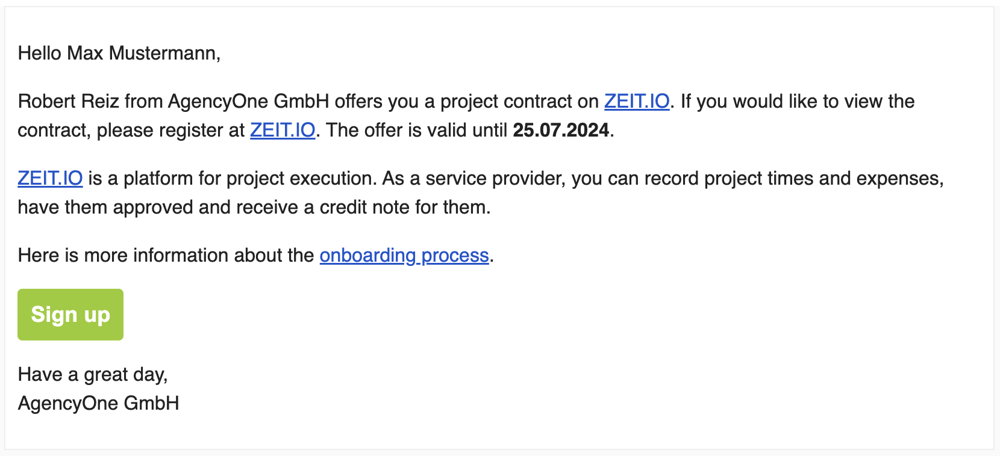
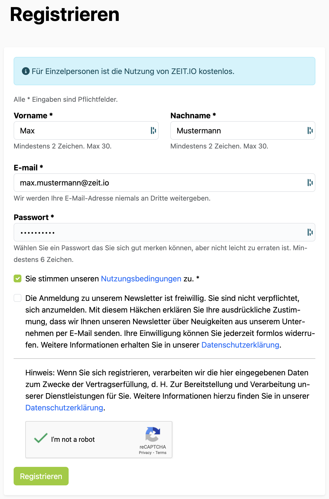
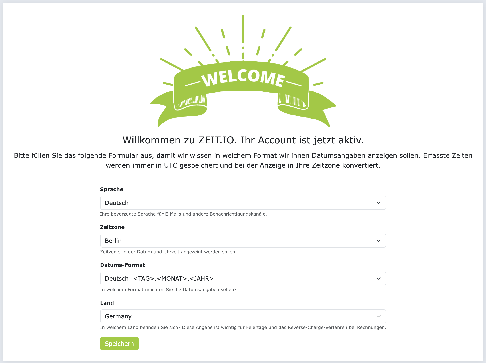
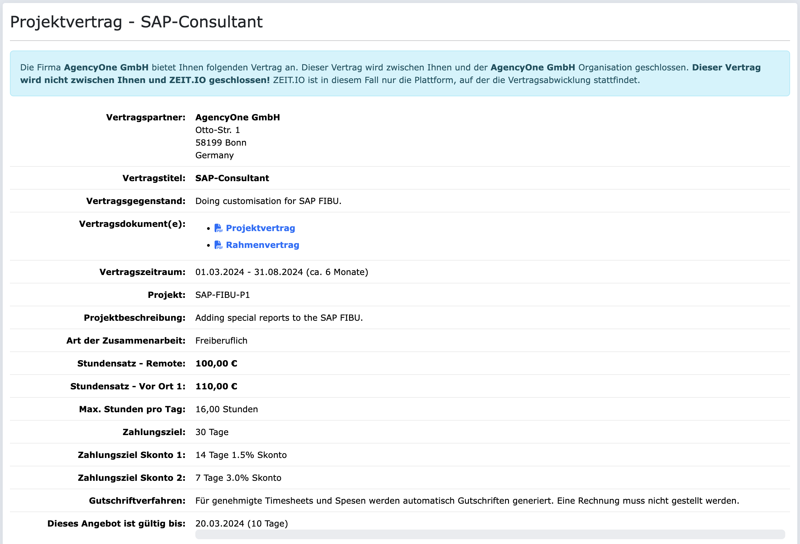

# Onboarding 

[ZEIT.IO](https://zeit.io) is a platform for time recording, project management and accounting. You can
Book times and expenses for projects here and apply for approval. For approved timesheets and
expenses you will receive a credit note. A credit note is a type of reverse invoice issued by the
Client, issued to the supplier. This means you no longer have to create an invoice.

## Invitation from an agency/organization

A ZEIT.IO organization always represents a company or an agency. The special thing about a
ZEIT.IO organization is the collaborative functions. In an organization, several people (employees,
freelancers, approvers, accountants, etc.) can work together on a project.

If you have received an invitation email from a ZEIT.IO organization, then the organization would like to
work with you and authorize you to book times and expenses on at least one of their projects.
In this case you will receive an invitation by email that may look like this:

{ width=100% }

The email talks about a contract. On ZEIT.IO, people and organizations are connected to each other through contracts
tied together. A contract regulates the cooperation between two parties and usually contains the following information:

- Contractual partner
- Subject of the contract
- Contract term (start and end dates)
- Contract conditions (e.g. hourly rate, daily rate, and so on.)
- Contract documents (e.g. general terms and conditions, NDA, and so on.)
- Project information (e.g. project name, project description, and so on.)

## Registration

If you want to view the contract offer, you must register at ZEIT.IO. Because there is sensitive data involved, 
the contract offer can only be viewed in the login area. To do this, please click on the
“Sign up” button in the email. Your firstname, lastname and email should be already prefilled in the form on the 
following page and all you have to do is to choose a password and to accept the terms and conditions. 
Here is an example for the registration page:

{ width=80% }

If you change your email address on the registration form, another verification email will be sent out to the
new email address. This is a security mechanism to ensure that the email address really belongs to you.

If you do not change the email address on this page and complete the registration process, then you will
automatically signed-in and redirected to the welcome page. This looks, for example, like this:

On the welcome page you can select your preferred language, time zone, date format and country.
You can change these settings later. If you click "Save" on the page, then
You will be redirected to the contract offer.

## Contract offer

A ZEIT.IO contract offer contains the most important key data for a successful collaboration:

- Contractual partners with official company names and addresses
- Contract title and subject matter
- Contract term (start and end dates)
- Contract documents (e.g. framework agreement, project contract, NDA, and so on..)
- Contractual conditions (e.g. an hourly rate, daily rate, or several hourly rates for remote/onsite, and so on.)
- Information about the project (project name, project description, and so on.)
- Payment terms (e.g. payment terms, payment method, and so on.)

Here's an example:

{ width=100% }

If you scroll further down the page, you will see a form that you can use to either
reject or accept the offer. If you want to accept the offer, you need to provide further information about your 
master data be made. For example, you must provide your own legal form, address, tax number and bank details.
Here's an example:

After accepting the contract offer, the project from the contract offer is visible for you and you
can book times and expenses on it.

## Further steps

The following topics might also be of interest to you:

- [Credit note procedure](/freiberufler/gutschriftverfahren.en): What is the credit process and how does it work?
- [Projects](/freiberufler/projekte.en): How can I view project details?
- [Time tracking](/freiberufler/zeiterfassung.en): How can I record project times?
- [Expenses](/freiberufler/ausgaben.en): How can I record expenses?
- [Approval process](/freiberufler/genehmigungsverfahren.en): How can I get my services approved?
