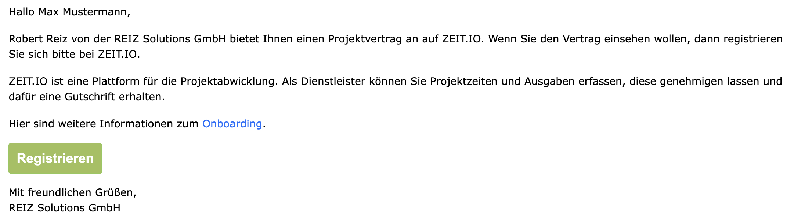

# Onboarding

[ZEIT.IO](https://zeit.io) ist eine Plattform für Zeiterfassung, Projektmanagement und Rechnungswesen. Sie können 
hier Zeiten und Ausgaben auf Projekte buchen und dafür eine Genehmigung beantragen. Für genehmigte Timesheets und 
Ausgaben werden in der Regel Gutschriften ausgestellt. Eine Gutschrift ist eine Art umgekehrte Rechnung, die vom 
Auftraggeber an den Lieferanten ausgestellt wird. Dadurch entfällt für Sie die Rechnungserstellung komplett.

## Einladung von einer Agentur / Organisation

Eine ZEIT.IO Organisation repräsentiert immer eine Firma, bzw. eine Agentur. Das besondere an einer
ZEIT.IO Organisation sind die kollaborativen Funktionen. In einer Organisation können mehrere Personen (Mitarbeiter,
Freiberufler, Genehmiger, Buchhalter, etc.) gemeinsam an einem Projekt arbeiten.

Wenn Sie eine Einladungs-E-Mail von einer ZEIT.IO Organisation erhalten haben, dann möchte die Organisation
mit Ihnen zusammenarbeiten und Sie dazu ermächtigen Zeiten und Ausgaben auf mindestens eines ihrer Projekte zu buchen.
In dem Fall werden Sie eine Einladung per E-Mail erhalten die z.B. so aussehen kann:

{ width=100% }

In der E-Mail ist von einem Vertrag die Rede. Auf ZEIT.IO sind Personen und Organisationen durch Verträge miteinander
verbunden. Ein Vertrag regelt die Zusammenarbeit zwischen zwei Parteien und enhält in der Regel folgende Informationen:

- Vertragspartner
- Vertragsgegenstand
- Vertragslaufzeit (Start- und Enddatum)
- Vertragskonditionen (z.B. Stundensatz, Tagessatz, etc.)
- Vertragsdokumente (z.B. AGBs, NDA, etc.)
- Projektinformationen (z.B. Projektname, Projektbeschreibung, etc.)

## Registrierung

Wenn Sie das Vertragsangebot einsehen wollen, dann müssen Sie sich bei ZEIT.IO registrieren. Da es sich hierbei
um sensible Daten handelt, ist das Vertragsangebot nur im Login-Bereich einsehbar. Dafür klicken Sie bitte auf den
"Registrieren" Button in der E-Mail. In dem Formular auf der folgenden Seite sollten dann schon ihr Vorname, Nachname 
und E-Mail vorbelegt sein, dann müssen Sie nur noch ein Passwort wählen und die AGBs akzeptieren. Hier ein Beispiel für 
die Registrierungsseite:

{ width=80% }

Wenn Sie beim Registrierungsformular die E-Mail Adresse ändern, dann wird eine weitere Verifizierungsmail an die
neue E-Mail Adresse verschickt. Das ist ein Sicherheitsmechanismus, um sicherzustellen, dass die E-Mail Adresse
auch wirklich Ihnen gehört.

Wenn Sie die E-Mail-Adresse auf dieser Seite nicht ändern und den Registrierungsprozess abschließen, dann werden Sie 
automatisch eingeloggt und auf die Welcome-Seite weitergeleitet. Diese sieht z.B. so aus:

Auf der Willkommensseite können Sie Ihre bevorzugte Sprache, Zeitzone, Datumsformat und Land auswählen.
Diese Einstellungen können Sie später auch noch ändern. Wenn Sie auf der Seite auf "Speichern" klicken, dann
werden Sie weitergeleitet auf das Vertragsangebot.

## Vertragsangebot

Ein ZEIT.IO Vertragsangebot enthält die wichtigsten Eckdaten für eine erfolgreiche Zusammenarbeit: 

 - Vertragspartner mit offiziellen Firmennamen und Anschrift
 - Vertragstitel und Vertragsgegenstand
 - Vertragslaufzeit (Start- und Enddatum)
 - Vertragsdokumente (z.B. Rahmenvertrag, Projektvertrag, NDA, etc.)
 - Vertragskonditionen (z.B. einen Stundensatz, Tagessatz, oder mehrere Stundensätze für Remote/Onsite, etc.)
 - Informationen zum Projekt (Projektname, Projektbeschreibung, etc.)
 - Zahlungsbedingungen (z.B. Zahlungsziel, Zahlungsweise, etc.)

Hier ein Beispiel: 

{ width=100% }

Wenn Sie auf der Seite weiter nach unten scrollen, dann folgt ein Formular, mit dessen Hilfe Sie das Angebot entweder 
ablehnen oder annehmen können. Wenn Sie das Angebot annehmen wollen, dann müssen Sie weitere Angaben zu Ihren Stammdaten 
machen. So müssen z.B. die eigene Rechtsform, Adresse, Steuernummer und die Bankverbindung angegeben werden. 
Hier ein Beispiel:

Nach dem Akzeptieren des Vertragsangebots, ist das Projekt aus dem Vertragsangebot für Sie freigeschaltet und Sie 
können Zeiten und Ausgaben auf das Projekt buchen.

## Weitere Schritte

Die folgenden Themen könnten für Sie auch interessant sein:

- [Gutschriftverfahren](/freiberufler/gutschriftverfahren): Was ist das Gutschriftverfahren und wie funktioniert es?
- [Projekte](/freiberufler/projekte): Wie kann ich Projektdetails einsehen?
- [Zeiterfassung](/freiberufler/zeiterfassung): Wie kann ich meine Zeiten erfassen?
- [Genehmigungsverfahren](/freiberufler/genehmigungsverfahren): Wie kann ich meine Zeiten genehmigen lassen?
   
