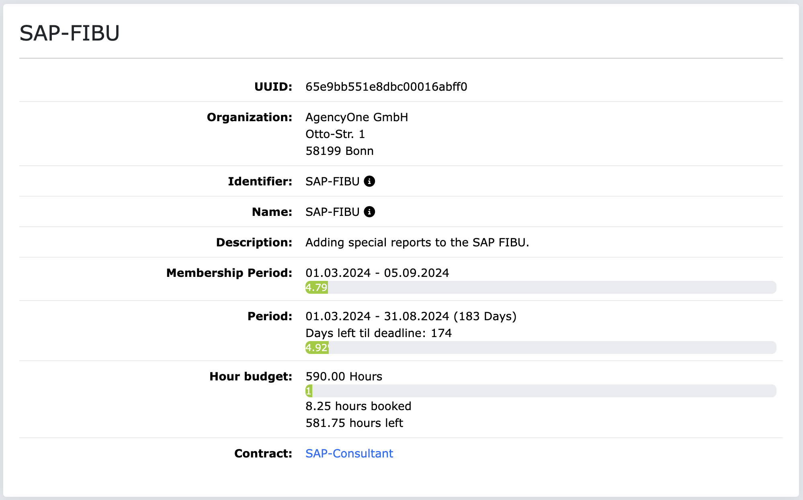
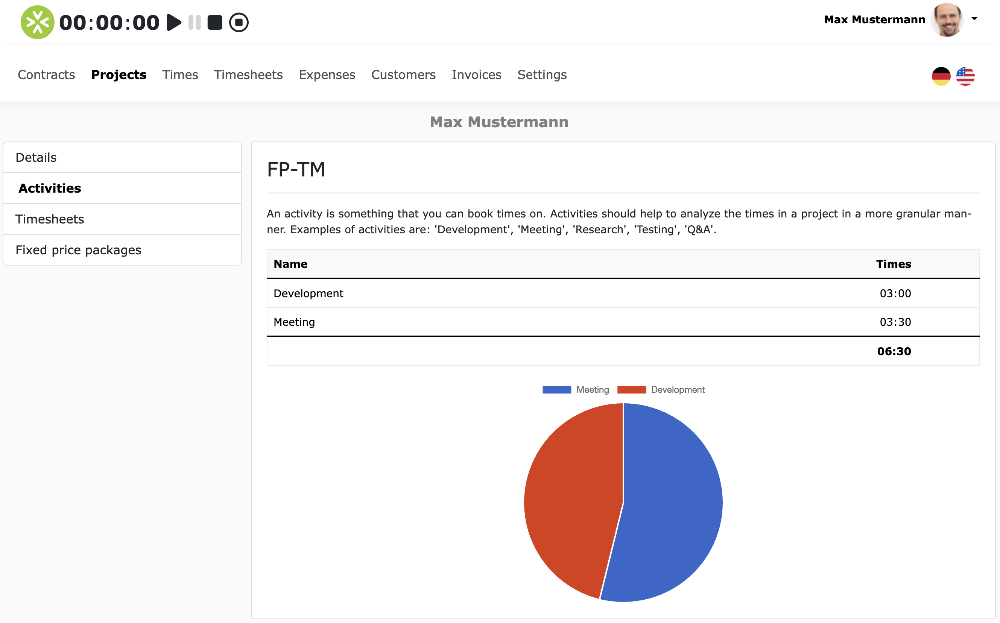
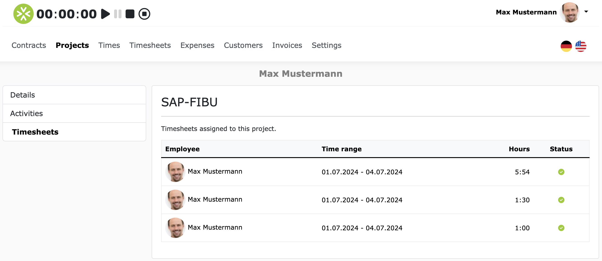
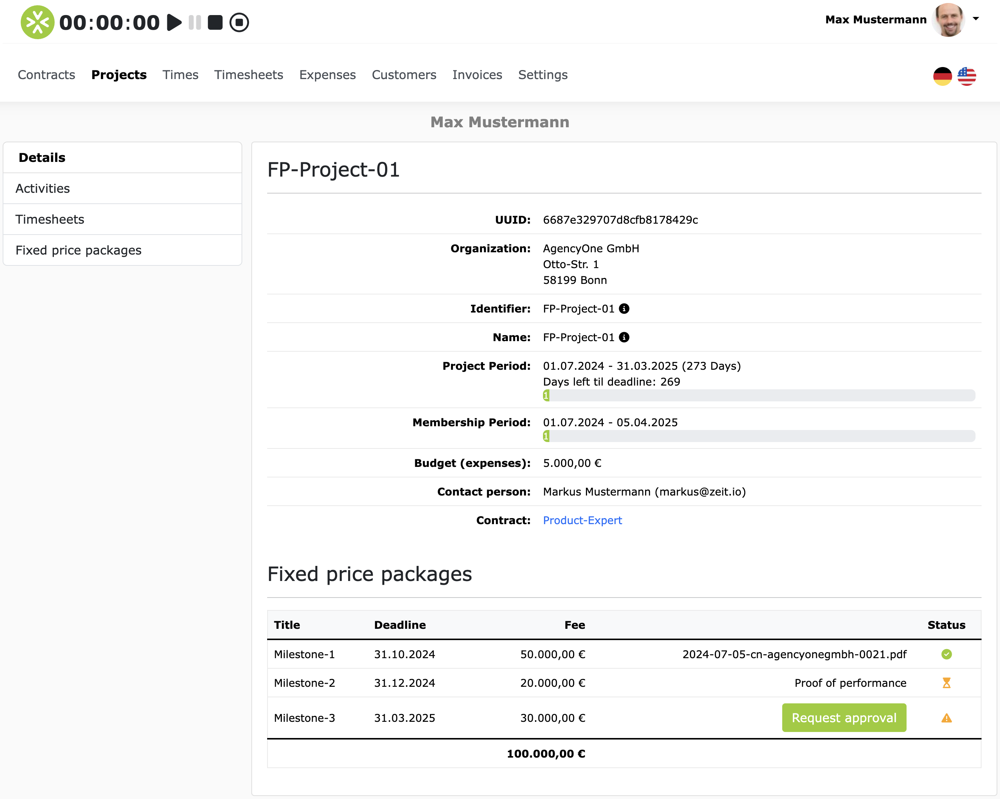
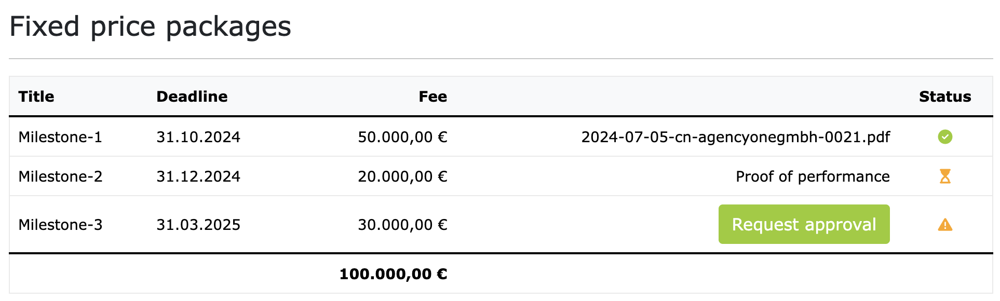

# Projects

If you click on "Projects" in the main menu, you will see a list of all the projects you have access to.
These can be projects created by an organization or projects you created yourself.

## View project details (Orga project)

If you click on a project, you will see the project details. Here's an example:

On the project detail page, you will see the following information:

- **Organization**: The name of the organization to which the project belongs.
- **Identifier**: The unique identifier of the project as used in the application.
- **Project name**: The official name of the project as it should appear on the invoice.
- **Project description**: A brief description of the project.
- **Project period**: Project start and project end. All bookings (time & expenses) must be within the project period. You will also see how many days are left until the project deadline.
- **Membership period**: The period for your personal membership in the project. The project is only visible to you during this period.
- **Hour budget**: The hour budget available for the project, how many hours have already been booked, and how many hours are still available.
- **Expense Budget**: The budget for expenses/travel costs available for the project.
- **Contact person**: If the project belongs to an organization and a contact person is stored in the project, the name and contact details of the contact person are displayed here. If you have any questions about the project, you can contact the contact person.
- **Contract**: If the project belongs to an organization, you will see the contract here, through which you have access to the project. If you click on the contract, you will see the contract details.

## Activities

Projects can optionally have "activities".
Activities are a way to further structure a project.
If a project has activities, then an activity must always be selected when recording time.
The activities can be, for example: "Analysis", "Design", "Development", "Testing", "Documentation" etc.
You can view the activities of the respective project if you click on "Activities" in the side menu on the left.
Here is an example:

## Proof of performance

Projects can optionally have "proof of performance".
If you have booked time for a project and requested approval for it, then there is at least one proof of performance that is assigned to the project.
If you click on "Proof of performance" in the side menu, you will see a list of all proof of performance that belongs to the project.
Here is an example:

## Fixed price packages

Projects can optionally have "fixed price packages".
A fixed price package represents a fixed trade within the project.
A fixed price package always has a title, a specification and a fixed price/fee.
If a project has fixed price packages, these are displayed directly below the project details.
Here is an example:

You can also view the fixed price packages in the side menu under "Fixed price packages".
If you click on the title of a fixed price package, you will see all the details, including the specification.

### Request approval for a fixed price package

In the overview table for fixed price packages, you can also request approvals directly.
A "Request approval" button appears for packages for which no approval has yet been requested.
If you click on the button, a dialog box opens in which you can request approval.

For packages for which approval has already been requested, a link to the proof of performance appears.
And if a package has already been approved, a link to the credit note appears in the row.
