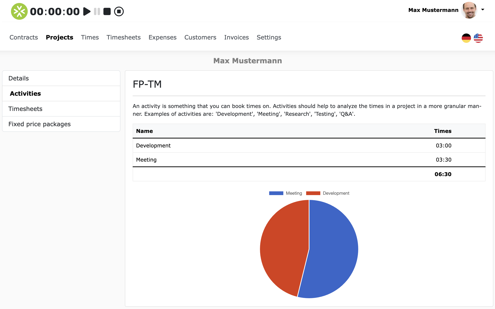
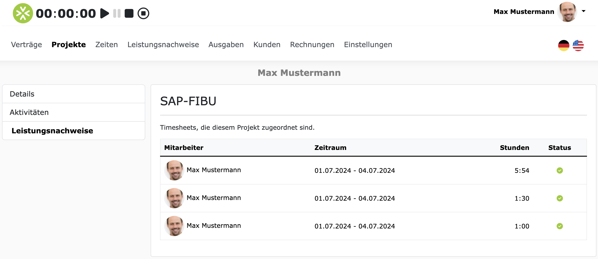
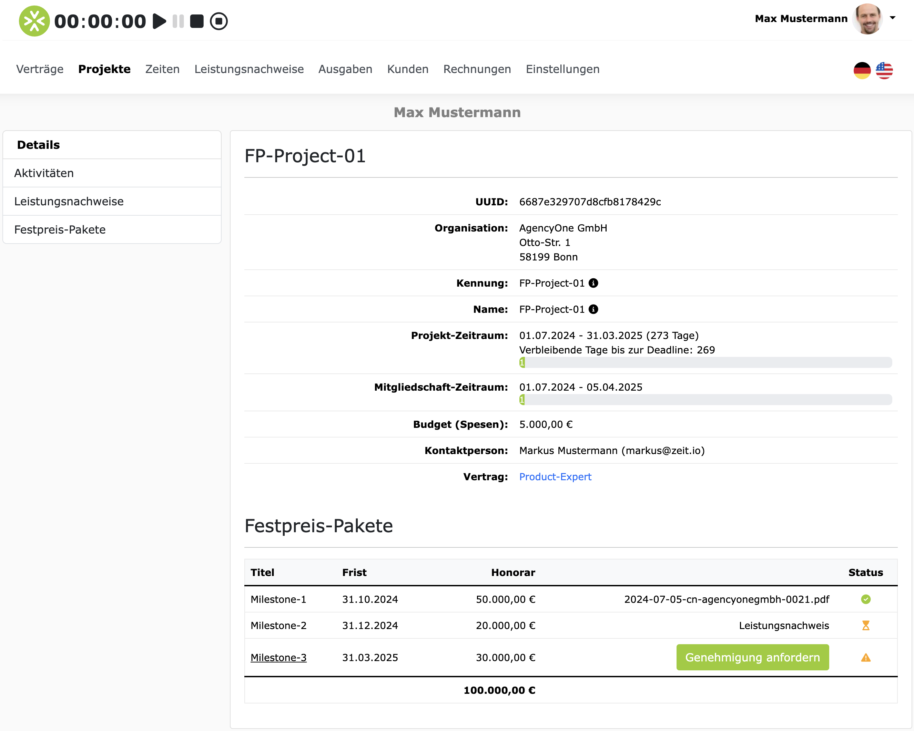
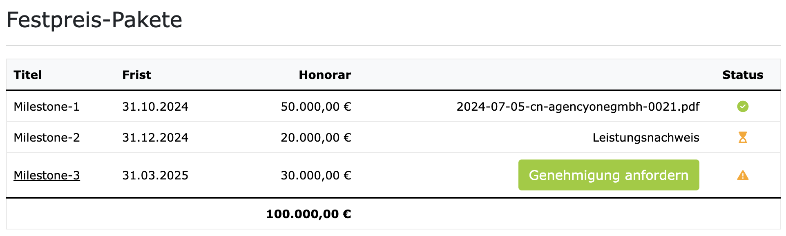

# Projekte

Wenn Sie im Hauptmenü auf "Projekte" klicken, dann sehen Sie eine Liste aller Projekte auf die Sie Zugriff haben.
Dies können Projekte sein, die von einer Organisation erstellt wurden, oder Projekte, die Sie selbst erstellt haben.

## Projektdetails ansehen (Orga-Projekt)

Wenn Sie auf ein Projekt klicken, dann sehen Sie die Projektdetails. Hier ein Beispiel:

Auf der Projektdetailseite sehen Sie folgende Informationen:

- **Organisation**: Der Name der Organisation, zu der das Projekt gehört.
- **Kennung**: Die eindeutige Kennung des Projekts, wie sie in der Anwendung verwendet wird.
- **Projektname**: Der offizielle Name des Projekts, wie sie auf der Rechnung erscheinen soll.
- **Projektbeschreibung**: Eine kurze Beschreibung des Projekts.
- **Projekt-Zeitraum**: Projektstart und Projektende. Alle Buchungen (Zeit & Ausgaben) müssen innerhalb des Projekts-Zeitraums liegen. Außerdem sehen Sie hier, wie viele Tage noch bis zur Deadline des Projekts verbleiben.
- **Mitgliedschaft-Zeitraum**: Der Zeitraum für Ihre persönliche Mitgliedschaft in dem Projekt. Das Projekt ist für Sie nur in diesem Zeitraum sichtbar.
- **Stundenbudget**: Das Stundenbudget, das für das Projekt zur Verfügung steht, wie viele Stunden bereits gebucht wurden und wie viele Stunden noch verfügbar sind.
- **Spesenbudget**: Das Budget für Spesen/Reisekosten, das für das Projekt zur Verfügung steht.
- **Kontaktperson**: Wenn das Projekt zu einer Organisation gehört und im Projekt eine Kontaktperson hinterlegt ist, dann werden hier Name und Kontaktdetails der Kontaktperson eingeblendet. Bei Fragen zum Projekt können Sie sich an diese Kontaktperson wenden.
- **Vertrag**: Wenn das Projekt zu einer Organisation gehört, dann sehen Sie hier den Vertrag, über den Sie Zugriff auf das Projekt haben. Wenn Sie auf den Vertrag klicken, dann sehen Sie die Vertragsdetails.

## Aktivitäten

Projekte können optional "Aktivitäten" haben. 
Aktivitäten sind eine Möglichkeit, um ein Projekt weiter zu strukturieren.
Wenn ein Projekt Aktivitäten hat, dann muss bei der Zeiterfassung auch immer eine Aktivität ausgewählt werden.
Die Aktivitäten können z.B. sein: "Analyse", "Design", "Entwicklung", "Testing", "Dokumentation" etc. 
Die Aktivitäten des jeweiligen Projekts können Sie einsehen, wenn Sie links im Seitenmenü auf "Aktivitäten" klicken.
Hier ein Beispiel: 

## Leistungsnachweise

Projekte können optional "Leistungsnachweise" haben.
Wenn Sie für ein Projekt Zeiten gebucht haben und dafür Genehmigung angefordert haben, dann gibt es mindestens einen Leistungsnachweis, welcher dem Projekt zugeordnet ist.
Wenn Sie im Seitenmenü auf "Leistungsnachweise" klicken, dann sehen Sie eine Liste aller Leistungsnachweise, die zu dem Projekt gehören.
Hier ein Beispiel:

## Festpreis-Pakete

Projekte können optional "Festpreis-Pakete" haben.
Ein Festpreis-Paket repräsentiert ein festes Gewerk innerhalb des Projektes. 
Ein Festpreis-Paket hat immer einen Titel, eine Spezifikation und einen festen Preis/Honorar.
Wenn ein Projekt Festpreis-Pakete hat, dann werden diese direkt unterhalb der Projektdetails angezeigt. 
Hier ein Beispiel:

Außerdem können Sie die Festpreis-Pakete auch im Seitenmenü unter "Festpreis-Pakete" einsehen.
Wenn Sie auf den Titel eines Festpreis-Pakets klicken, dann sehen Sie alle Details, samt Spezifikation.

### Genehmigung anfordern für ein Festpreis-Paket

In der Übersichtstabelle für Festpreis-Pakete können Sie auch direkt Genehmigungen anfordern.
Pakete, für die noch keine Genehmigung beantragt wurde, erscheint ein Button "Genehmigung anfordern".
Wenn Sie auf den Button klicken, dann öffnet sich ein Dialog, in dem Sie die Genehmigung beantragen können.

Pakete, für die bereits eine Genehmigung beantragt wurde, erscheint ein Link zum Leistungsnachweis.
Und ein Paket bereits genehmigt wurde, dann erscheint in der Zeile ein Link zur Gutschrift.
