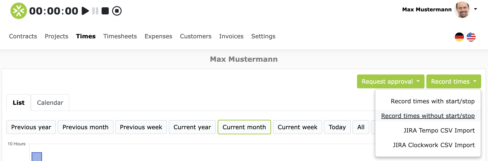

# Time tracking 

Time recording is an elementary function in ZEIT.IO. There are several ways you can track your project times:

- **Timer**: Track your times with the timer, with start, stop and break times.
- **Calendar**: Record your times in the calendar using “drag & drop”.
- **Hourly form**: Record your times manually by duration (hours & minutes), without start and stop time.
- **Daily form**: Record your times on a daily basis, without start and stop times.
- **Import**: Import your times from another system.

There are also various clients you can use to record your times:

- **WebApp**: Record your times in the web browser on the [ZEIT.IO page](https://zeit.io/en/).
- **Browser extension**: Record your times independently from the ZEIT.IO page, with the ZEIT.IO browser extension.
- **Mobile**: Record your times on your smartphone.

## Timer

The easiest way to record is via the timer.
The timer is always located in the top left of the login area.
Regardless of the context you are in, the timer is always in the same place.
The functions of the timer are shown graphically here.

You can start, pause, continue and stop the timer at any time.
If you click on the stop symbol, a modal dialog opens in which you can complete the booking.
You only have to decide which project you want to book the time for at the end of the booking.
This is a great advantage because you don't have to decide beforehand, you can just start the timer and then decide 
later which project you want to book the time for.

Here is an example of the modal dialog that opens when you stop the timer:

Except for "Duration", all input fields in the modal dialog are editable.
This means that you can still make adjustments before saving.
If you have forgotten to track a break, you can easily add it here and also adjust the from-to times again.

The input field for "hourly rate" is a dropdown field.
Depending on the project, the hourly rate can also change.
If you have two or more hourly rates in a project, you can select the hourly rate for which you want to book the time here.
Most of the time you only have one hourly rate per project and in that case the selection field is "disabled".
In many projects, however, there is also an hourly rate for remote work and one for on-site work.
In that case, you can select the hourly rate that applies to the booked time here.

If you click "Save & Close", the time will be booked, the timer will be reset to 00:00:00 and the modal dialog will be closed again.

### Keyboard shortcuts for the timer

You can also control the timer using the keyboard. This works with these keyboard shortcuts:

- **Start**: `s`
- **Pause**: `p`
- **Resume**: `s`
- **Stop**: `e`

The form in the modal dialog can be sent using the keyboard shortcut `Ctrl + Enter` (`Command + Enter` on Mac).
This allows you to record times very quickly, even without a mouse.

## Re-enter times with the timer 

You can also record times that you previously forgot. You don't have to start the timer separately for this.
If it is not running, i.e. is set to `00:00:00`, you can still click on the stop symbol.
This opens the modal dialog window and you can record the times. 
In the upper left area of the modal dialog window you can also select the date for which you want to record the times.

If you want to record several bookings at once, feel free to use the "Save & New" button.
This saves the current booking and the modal dialog window remains open so that you can record the next booking straight away.

### Re-enter times with the timer when the timer is already running

If the timer is already running and you want to record times with start and stop times without stopping the running timer, you can use the fourth symbol in the row, the black square in the circle.
This opens the modal dialog for time recording and you can record times with start and stop times.
After saving, the timer continues to run.

## Calendar

If you click on "Times" in the main menu and then on the "Calendar" tab, the calendar view opens.
The calendar shows all bookings that have a start and stop time.
These are all bookings that were recorded with the timer.
Bookings that do not have a start and stop time are not shown in the calendar!

Time recording in the calendar works with "drag & drop", i.e. you can simply enter the times in the calendar using the mouse.
Navigate in the calendar to the day for which you want to record a booking.
Then click on the start time, hold down the mouse button, and drag the mouse to the end time.
When you release the mouse, the modal dialog window for time recording opens and the form is already filled with the correct values for date, from and to time.
All you have to do then is select the project, enter a comment and click "Save".

Here is an example of time recording in the calendar:

## Hourly form

The hours form is a simple form in which you can record the duration (hours & minutes) per project and date.
You can access the form by clicking on "Times" in the main menu and then, in the top right, clicking on the green button "Record hours".
This opens a dropdown with various options. Then click on "Record without start/stop".

This opens the hours form. Here you can select a date in the calendar and then enter the duration (hours & minutes) per project. 
The form looks like this:

## Daily form

You can use the daily form to record your expenses on a daily basis.
We assume that each working day corresponds to 8 hours.
The daily form is only visible if you have at least one contract in which a daily rate is agreed.
If you only have active contracts with hourly rates, the daily form will not be displayed!

If you have a contract with a daily rate agreement and click on "Times" in the main menu, a "Daily rate recording" tab will appear.
This tab is also the first tab and is already preselected.

The daily form looks like this:

You can select the project and the month of performance on the page and then enter the number of working days per month.
To do this, simply click on the days you worked.
A line will then appear in the form for each working day in which you can fill in the following three fields:

- **Duration**: Here you can specify whether you worked a full day (8 hours), half a day (4 hours),
  or just a quarter of a day (2 hours).
- **Daily rate**: The second drop-down field is the daily rate. Here you can select whether you worked remotely or on-site.
  This drop-down field only appears if you have agreed on several daily rates in the project.
  If you only have one daily rate, then the field will not be displayed.
- **Comment**: Here you can enter a short description of your work.

At the very bottom of the page you can click on "Save" to save the working days.

## FAQs

### What happens to the timer if I log out or accidentally close the window?

The start time of the timer is stored on the server.
This means that the timer continues to run even if you log out, so you can log out and log back in later and the timer will continue to run.
You can also start the timer, then close the browser and open it again later and the timer will continue to run.
So it will keep running until you stop it.

### Are the comments in time tracking mandatory?

Whether the comments for time bookings are mandatory or not is always configured in the project.
So it may well be that the comments for time bookings are mandatory for project A, but not for project B.
It always depends on the requirements of the project.
