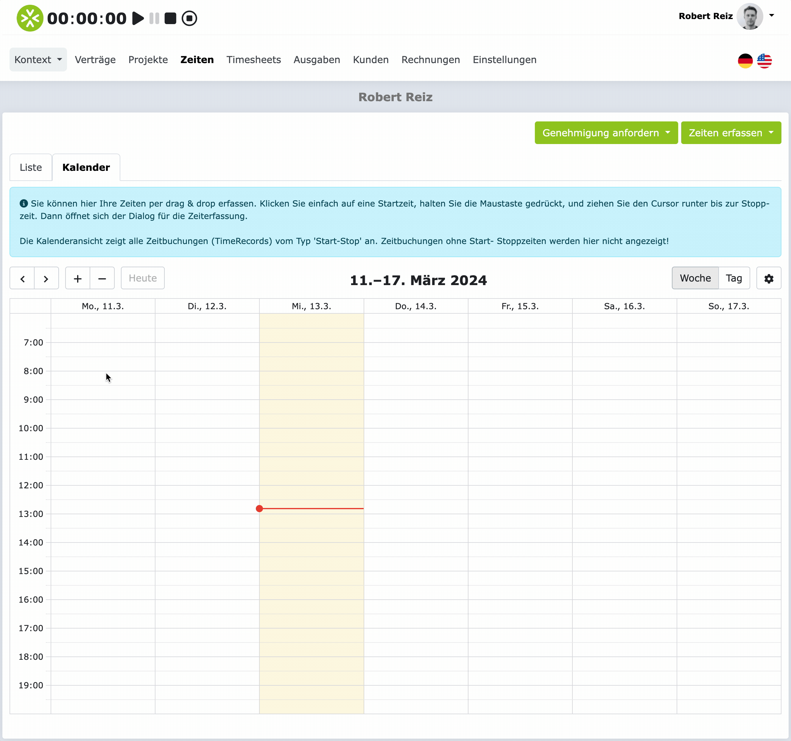
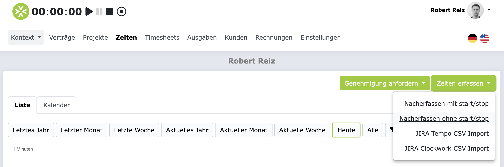

# Zeiterfassung

Die Zeiterfassung ist eine elementare Funktion in ZEIT.IO. Es gibt verschiedene Möglichkeiten,
wie Sie Ihre Projektzeiten erfassen können:

- **Timer**: Erfassen Sie Ihre Zeiten mit dem Timer, mit Start-, Stop- und Pausenzeiten.
- **Kalender**: Erfassen Sie Ihre Zeiten im Kalender, mit "Drag and Drop".
- **Stunden-Formular**: Erfassen Sie Ihre Zeiten manuell über die Dauer (Stunden & Minuten), ohne Start- und Stoppzeit.
- **Tages-Formular**: Erfassen Sie Ihre Zeiten tageweise, ohne Start- und Stoppzeit.
- **Import**: Importieren Sie Ihre Zeiten aus einem anderen System.

Außerdem gibt es verschiedene Clients, mit denen Sie Ihre Zeiten erfassen können:

- **WebApp**: Erfassen Sie Ihre Zeiten im Webbrowser auf der [ZEIT.IO Seite](https://zeit.io/de/).
- **Browser-Extension**: Erfassen Sie Ihre Zeiten im Browser, über die ZEIT.IO Browser-Extension, unabhängig
  von der ZEIT.IO Seite.
- **Mobile**: Erfassen Sie Ihre Zeiten auf dem Smartphone.

## Timer

Am einfachsten ist die Erfassung über den Timer. Der Timer
befindet sich, im Login-Bereich, immer links oben. Unabhängig vom Kontext, in dem Sie sich befinden,
ist der Timer immer an der gleichen Stelle. Hier sind die Funktionen des Timers grafisch dargestellt.

Sie können jederzeit den Timer starten, pausieren, fortsetzen und stoppen. Wenn Sie auf das Stop-Symbol klicken,
dann öffnet sich ein modaler Dialog, in dem Sie die Buchung abschließen können. Erst am Ende der Buchung müssen Sie
sich entscheiden, auf welches Projekt Sie die Zeit buchen wollen. Das ist ein großer Vorteil, weil Sie sich nicht
vorher festlegen müssen. Sie können den Timer starten und dann später entscheiden, auf welches Projekt Sie die Zeit buchen.

Hier ein Beispiel für das modale Dialogfenster, das sich öffnet, wenn Sie den Timer stoppen:

Bis auf "Dauer", sind alle Eingabefelder im modalen Dialog editierbar. Das bedeutet dass Sie, vor der Speicherung,
noch Anpassungen vornehmen können. Wenn Sie vergessen haben eine Pause zu tracken, dann können Sie die Pausenzeit hier
nachtragen. Das ist kein Problem. Sie können auch die Von- Bis-Zeiten nochmal anpassen.

Das Eingabefeld für "Stundensatz" ist ein Dropdown-Feld. Abhängig vom Projekt, kann sich auch der Stundensatz ändern.
Wenn Sie in einem Projekt zwei oder mehr Stundensätze haben, dann können Sie hier den Stundensatz auswählen,
für den Sie die Zeit buchen wollen. Meistens hat man nur einen Stundensatz pro Projekt und in dem Fall ist das
Auswahlfeld dann "disabled". In vielen Projekten gibt es aber auch einen Stundensatz für Remote-Arbeit und einen
für Onsite-Arbeit. In dem Fall können Sie hier den Stundensatz auswählen, der für die gebuchte Zeit gilt.

Wenn Sie auf "Speichern & Schließen" klicken, dann wird die Zeit gebucht, der Timer wird zurückgesetzt auf 00:00:00
und das modale Dialog wird wieder geschlossen.

### Tastenkürzel für den Timer

Den Timer können Sie auch über die Tastatur steuern. Das funktioniert mit diesen Tastenkürzeln:

- **Starten**: `s`
- **Pausieren**: `p`
- **Fortsetzen**: `s`
- **Stoppen**: `e`

Das Formular im modalen Dialog kann mit der Tastenkombination `Strg + Enter` (`Command + Enter` auf Mac)
abgeschickt werden. Damit lassen sich Zeiten sehr schnell erfassen, auch ohne Maus.

### Zeiten nacherfassen mit dem Timer

Sie können auch Zeiten nacherfassen, die Sie vergessen haben zu erfassen. Dafür müssen Sie den Timer nicht extra starten.
Wenn der Timer nicht läuft, also auf `00:00:00` steht, dann können Sie trotzdem auf das Stopp-Symbol klicken.
Dadurch öffnet sich das modale Dialogfenster und Sie können die Zeiten nacherfassen. Im linken oberen Bereich des
modalen Dialogfensters, können Sie auch das Datum auswählen, für das Sie die Zeiten nacherfassen wollen.

Wenn Sie gleich mehrere Buchungen nacherfassen wollen, dann nutzen Sie gerne den "Speichern & Neu" Button. Damit wird
die aktuelle Buchung gespeichert und das modalen Dialogfenster bleibt geöffnet, damit Sie gleich die nächste Buchung
erfassen können.

### Zeiten nacherfassen mit dem Timer, wenn der Timer schon läuft

Wenn der Timer schon läuft und sie Zeiten mit Start- und Stoppzeit nacherfassen wollen, ohne den laufenden Timer
zu stoppen, dann können Sie dafür das vierte Symbol in der Reihe verwenden. Das schwarze Viereck im Kreis.
Damit öffnet sich der modale Dialog für die Zeiterfassung und Sie können Zeiten nacherfassen,
mit Start- und Stoppzeiten. Nach dem Speichern läuft der Timer weiter.

## Kalender

Wenn Sie im Hauptmenü auf "Zeiten" klicken und dann auf den Tab "Kalender", dann öffnet sich die Kalender-Ansicht.
Der Kalender zeigt alle Buchungen an, die eine Start- und Stoppzeit haben. Das sind also alle Buchungen, die mit dem Timer
erfasst wurden. Buchungen, die keine Start- und Stoppzeit haben, werden im Kalender nicht angezeigt!

Die Zeiterfassung im Kalender funktioniert mit "drag & drop". Sie können die Zeiten also einfach per Maus
im Kalender eintragen. Navigieren Sie im Kalender zu dem Tag, für den Sie eine Buchung erfassen wollen. Klicken Sie
dann auf die Startzeit, halten die Maustaste gedrückt, und ziehen Sie die Maus bis zur Endzeit. Wenn Sie die Maus
loslassen, dann öffnet sich das modale Dialogfenster für die Zeiterfassung und das Formular ist schon mit den
richtigen Werten für Datum, Von- und Bis-Zeit gefüllt. Sie müssen dann nur noch das Projekt auswählen, einen
Kommentar eingeben und auf "Speichern" klicken.

Hier ein Beispiel für die Zeiterfassung im Kalender:

## Stunden-Formular

Das Stunden-Formular ist ein einfaches Formular, in dem Sie die Dauer (Stunden & Minuten) pro Projekt und Datum
erfassen können. Das Formular könnnen Sie aufrufen, indem Sie im Hauptmenü auf "Zeiten" klicken und dann, rechts oben,
auf den grünen Button "Stunden erfassen" klicken. Das öffnet einen Dropdown, mit verschiedenen Optionen. Klicken Sie
dann auf "Nacherfassen ohne Start/Stop".

Damit öffnet sich dann das Stunden-Formular. Hier können Sie im Kalender ein Datum auswählen und dann die Dauer
(Stunden & Minuten) pro Projekt erfassen. Das Formular sieht so aus:

## Tages-Formular

Mit dem Tages-Formular können Sie Ihre Aufwände tageweise erfassen. Dabei gehen wir davon aus, dass jeder Arbeitstag
8 Stunden entspricht. Das Tages-Formular ist nur dann sichtbar, wenn Sie mindestens einen Vertrag haben, in dem ein
Tagessatz vereinbart ist. Wenn Sie nur aktive Verträge mit Stundensätzen haben, dann wird das Tages-Formular nicht
angezeigt!

Wenn Sie einen Vertrag mit einer Tagessatz-Vereinbarung haben, und dann im Hauptmenü auf "Zeiten" klicken, dann
erscheint ein Tab "Tagessatz-Erfassung". Dieser Tab ist dann auch der erste Tab und bereits vorausgewählt.

Das Tages-Formular sieht so aus:

Sie könne auf der Seite das Projekt und den Leistungsmonat auswählen und dann die Anzahl der Arbeitstage pro Monat
erfassen. Dazu klicken Sie einfach die Tage an, an denen Sie gearbeitet haben. Für jeden Arbeitstag erscheint dann
ein Eingabefeld, in dem Sie eine kurze Arbeitsbeschreibung eingeben können. Ganz unten auf der Seite können Sie dann
auf "Speichern" klicken, um die Arbeitstage zu erfassen.

## FAQs

### Was passiert mit dem Timer, wenn ich mich auslogge, oder versehentlich das Fenster schließe?

Die Startzeit des Timers wird auf dem Server gespeichert. Das bedeutet, dass der Timer auch weiterläuft, wenn Sie sich
ausloggen. Sie können sich also ausloggen und später wieder einloggen und der Timer läuft weiter. Sie können auch
den Timer starten, dann den Browser schließen und später wieder öffnen und der Timer läuft weiter. Der Timer läuft
also immer weiter, bis Sie ihn stoppen.

### Sind die Kommentare in der Zeiterfassung Pflicht?

Das kommt immer auf das jeweilige Projekt an. Ob die Kommentare für Zeitbuchungen verpflichtend sind oder nicht, wird
immer im Projekt konfiguriert. Es kann also gut sein das die Kommentare für Zeitbuchungen für Projekt A verpflichtend
sind, für Projekt B aber nicht. Das hängt immer von den Anforderungen des Projekts ab.
