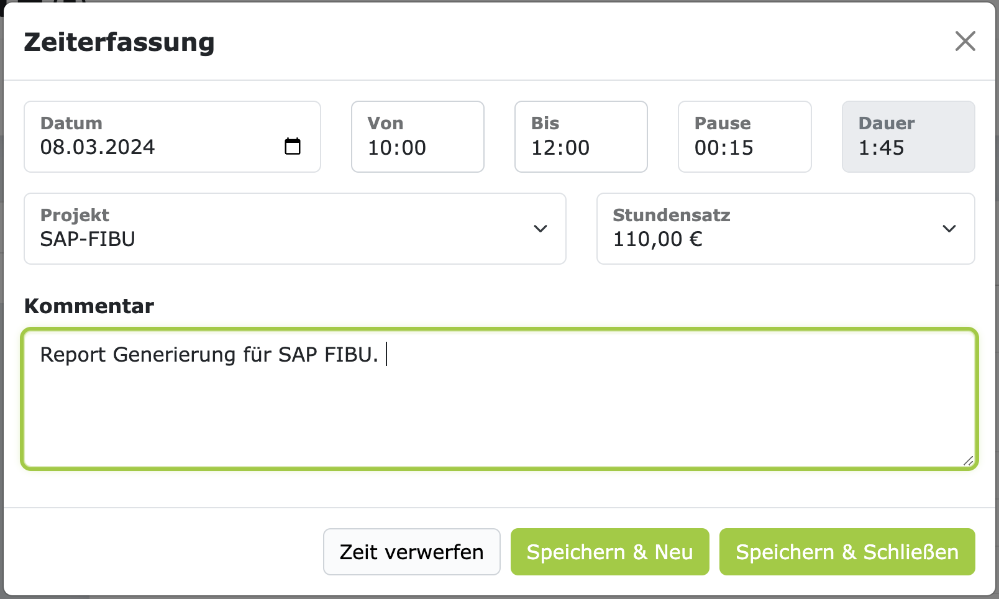

# Zeiterfassung

Die Zeiterfassung ist eine elementare Funktion in ZEIT.IO. Es gibt verschiedene Möglichkeiten,
wie Sie Ihre Projektzeiten erfassen können:

- **Timer**: Erfassen Sie Ihre Zeiten mit dem Timer, mit Start-, Stop- und Pausenzeiten.
- **Kalender**: Erfassen Sie Ihre Zeiten im Kalender, mit "Drag and Drop".
- **Dauer**: Erfassen Sie Ihre Zeiten manuell über die Dauer (Stunden & Minuten), ohne Start- und Stoppzeit.
- **Tageweise**: Erfassen Sie Ihre Zeiten tageweise, ohne Start- und Stoppzeit.

Außerdem gibt es verschiedene Clients, mit denen Sie Ihre Zeiten erfassen können:

- **WebApp**: Erfassen Sie Ihre Zeiten im Webbrowser auf der ZEIT.IO Seite.
- **Browser-Extension**: Erfassen Sie Ihre Zeiten im Browser, über die ZEIT.IO Browser-Extension, unabhängig
  von der ZEIT.IO Seite.
- **Mobile**: Erfassen Sie Ihre Zeiten auf dem Smartphone.

## Timer

Am einfachsten ist die Erfassung über den Timer. Der Timer
befindet sich, im Login-Bereich, immer links oben. Unabhängig vom Kontext, in dem Sie sich befinden.
Hier sind die Funktionen des Timers grafisch dargestellt.

Sie können jederzeit den Timer starten, pausieren, fortsetzen und stoppen. Wenn Sie auf das Stop-Symbol klicken,
dann öffnet sich ein modaler Dialog, in dem Sie ein Projekt auswählen können, auf das Sie die Zeit buchen wollen.
Außerdem können Sie hier auch noch eine Beschreibung eingeben und die Dauer anpassen. Hier ein Beispiel:

Das Eingabefeld für "Stundensatz" ist ein Dropdown-Feld. Abhängig vom Projekt, kann sich auch der Stundensatz ändern.
Wenn Sie in einem Projekt zwei oder mehr Stundensätze haben, dann können Sie hier den Stundensatz auswählen,
für den Sie die Zeit buchen wollen. Meistens hat man nur einen Stundensatz pro Projekt und in dem Fall ist das
Auswahlfeld dann "disabled". In vielen Projekten gibt es aber auch einen Stundensatz für Remote-Arbeit und einen
für Onsite-Arbeit. In dem Fall können Sie hier den Stundensatz auswählen, der für die gebuchte Zeit gilt.

Wenn Sie auf "Speichern & Schließen" klicken, dann wird die Zeit gebucht, der Timer wird zurückgesetzt auf 00:00:00
und das modale Dialog wird wieder geschlossen.

### Zeiten nacherfassen mit Start- und Stoppzeit

Wenn der Timer schon läuft und sie Zeiten mit Start- und Stoppzeit nacherfassen wollen, ohne den laufenden Timer
zu stoppen, dann können Sie dafür das vierte Symbol in der Reihe verwenden. Das schwarze Viereck im Kreis.
Damit öffnet sich ein modaler Dialog für die Zeiterfassung und Sie können Zeiten nacherfassen,
mit Start- und Stoppzeiten. In dem Dialogfenster, links oben, können Sie auch noch das Datum auswählen.

### Tastenkürzel für den Timer

Den Timer können Sie auch über die Tastatur steuern. Das funktioniert mit diesen Tastenkürzeln:

- **Starten**: `s`
- **Pausieren**: `p`
- **Fortsetzen**: `s`
- **Stoppen**: `e`

Das Formular im modalen Dialog kann mit der Tastenkombination `Strg + Enter` (`Command + Enter` auf Mac)
abgeschickt werden. Damit lassen sich Zeiten sehr schnell erfassen, auch ohne Maus. 

