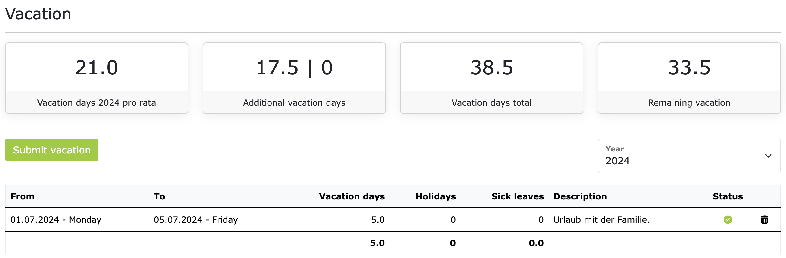

# Vacations 

As an employee, you can submit and view vacation requests. If you are in the context of permanent employment, 
then you have the “Vacations” item directly in the main menu. When you click on it, the first thing you will see is 
a list of upcoming holidays. Directly below is the vacation area. This could look like this, for example:

The tiles display the most important holiday KPIs for the selected year. Directly below is the list of submitted 
vacation requests. Here is the information explained in the tiles, from left to right:

- **Holiday pro rata**: This is the pro-rata vacation you are entitled to in the selected year.
  This depends on your starting date and the number of regular vacation days per year that are agreed in your employment contract.
- **Additional vacation days**: The second tile shows the number of additional vacation days you receive in the selected year. 
  This tile always shows two numbers. The first number is the number of vacation days carried over from last year. 
  Many companies allow unused vacation days to be carried over to the next year. These additional vacation days from last year 
  often have an expiration date. In most cases, these vacation days must be taken by March 31 of the following year. 
  The second number in the tile shows the number of granted special vacation days. For special occasions, such as marriage, 
  moving, death in the family, and so on, the employer can grant you special leave. Special leave is not deducted from the existing 
  vacation quota.
- **Total vacation days**: The third tile shows the number of vacation days you have available in the selected year. 
  This is the sum of the pro-rata vacation and the additional vacation days.
- **Remaining vacation**: The fourth tile shows the number of vacation days still available to you. This is the difference 
  between the "total vacation days" and the vacation days already submitted and approved.

## Submit a vacation request

To submit a vacation request, click the "Submit vacation" button. On the next page, you can then select whether you want to
apply for several days, one day, or half a day of vacation. Then select the start and end date and optionally enter a reason.
Clicking "Save" will create the vacation request.

By default, vacation requests must be approved by your supervisor. If this is also configured for your contract,
your supervisor will receive an email notification and can then comment, approve, or reject the vacation request.
You will then be notified by email as soon as your supervisor has processed the vacation request.

If the vacation request approval process is not activated in your contract, then any requested vacation is automatically approved.

## FAQs

### Why can't I apply for half a day of vacation?

Legally speaking, there are no half vacation days in Germany. Because that would be contrary to the goal of relaxation.
However, employers and employees can agree in the employment contract that half vacation days can be taken.
Whether this option is available to you in ZEIT.IO depends on the configuration of your contract. If you believe that 
you are entitled to half vacation days, please contact your supervisor or the HR department. They can activate the 
option for half vacation days in your contract.

### How can I apply for special leave?

As an employee, you cannot apply for special leave. Special leave is granted by the employer and is usually tied to 
special occasions, such as marriage, moving, death in the family, and so on. If you believe that you are entitled to 
special leave, please contact your supervisor or the HR department. They can then check whether special leave can be 
granted to you and enter the corresponding vacation days in ZEIT.IO.
