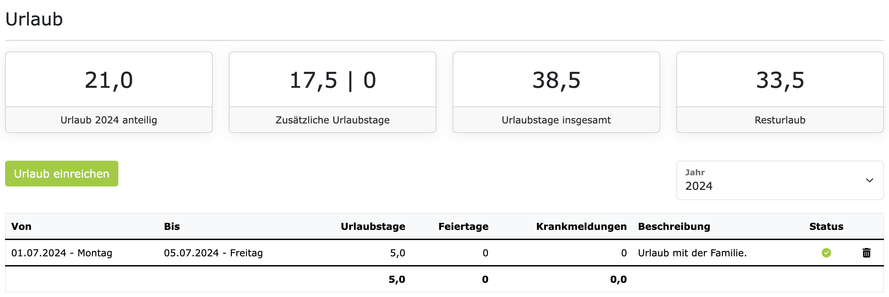

# Urlaube 

Als Mitarbeiter können Sie Urlaubsanträge stellen und einsehen. Wenn Sie sich im Kontext der Festanstellung 
befinden, dann haben Sie direkt im Hauptmenü, den Punkt "Urlaube". Wenn Sie darauf klicken, dann sehen Sie 
als allererstes eine Liste mit den anstehenden Feiertagen. Direkt darunter ist der Bereich für die Urlaube.
Das kann z.B. so aussehen:

Die Kacheln zeigen die wichtigsten Urlaubs-KPIs an, für das ausgewählte Jahr. Direkt darunter ist die Liste
mit den eingereichten Urlaubsanträgen. Hier sind die Informationen in den Kacheln erklärt, von links nach rechts:

- **Urlaub anteilig**: Das ist der anteilige Urlaub, der Ihnen im ausgewählten Jahr zusteht.
  Das ist abhängig von Ihrem Eintrittsdatum und der Anzahl der regulären Urlaubstage pro Jahr, die in Ihrem
  Arbeitsvertrag vereinbart sind.
- **Zusätzliche Urlaubstage**: Die zweite Kachel zeigt die Anzahl der zusätzlichen Urlaubstage an, die Sie
  im ausgewählten Jahr erhalten. In dieser Kachel werden immer zwei Zahlen angezeigt. Die erste Zahl ist die
  Anzahl der Urlaubstage, die aus dem letzten Jahr übertragen wurden. Viele Unternehmen erlauben es, dass
  nicht genommene Urlaubstage in das nächste Jahr übertragen werden können. Diese zusätzlichen Urlaubstage
  aus dem letzten Jahr haben dann oft ein Verfallsdatum. In den meisten Fällen müssen diese Urlaubstage
  bis zum 31. März des Folgejahres genommen werden. 
  Die zweite Zahl in der Kachel zeigt die Anzahl von
  gewährten Sonderurlaubstagen an. Für besondere Anlässe, wie z.B. Hochzeit, Umzug, Todesfall in der Familie, etc.,
  kann Ihnen der Arbeitgeber Sonderurlaub gewähren. Sonderurlaub wird nicht vom bestehenden Urlaubskontingent abgezogen.
- **Urlaubstage imsgesammt**: Die dritte Kachel zeigt die Anzahl der Urlaubstage an, die Sie im ausgewählten Jahr
  insgesamt zur Verfügung haben. Das ist die Summe aus dem anteiligen Urlaub und den zusätzlichen Urlaubstagen.
- **Resturlaub**: Die vierte Kachel zeigt die Anzahl der Urlaubstage an, die Ihnen noch zur Verfügung stehen. Das ist
  die Differenz aus de "Urlaubstage insgesamt" und den bereits eingereichten und genehmigten Urlaubstagen.

## Urlaubsantrag stellen

Um einen Urlaubsantrag zu stellen, klicken Sie auf den Button "Urlaub einreichen". Auf der nächsten Seite können Sie
dann auswählen, ob Sie mehrere Tage, ein Tage oder einen halben Tag Urlaub beantragen wollen. Anschließend
wählen Sie das Start- und Enddatum aus und geben optional eine Begründung ein. Mit dem Klick auf "Speichern"
wird der Urlaubsantrag erstellt.

Standardmäßig müssen Urlaubsanträge von Ihrem Vorgesetzten genehmigt werden. Wenn das für Ihren Vertrag auch so
konfiguriert ist, dann wird Ihr Vorgesetzter eine E-Mail-Benachrichtigung erhalten und kann den Urlaubsantrag
dann kommentieren, genehmigen oder ablehnen. Sie werden dann per E-Mail benachrichtigt, sobald Ihr Vorgesetzter
den Urlaubsantrag bearbeitet hat.

Wenn der Genehmigungsprozess für Urlaubsanträge in Ihrem Vertrag nicht aktiviert ist, dann wird jeder beantragte
Urlaub automatisch genehmigt.

## FAQs

### Wieso kann ich keinen halben Urlaubstag beantragen?

Rein rechtlich gesehen gibt es in Deutschland keine halben Urlaubstage. Den das würde dem Ziel der Erholung
entgegenstehen. Allerdings können Arbeitgeber und Arbeitnehmer, im Arbeitsvertrag vereinbaren, dass halbe Urlaubstage
genommen werden können.

Ob Ihnen diese Option in ZEIT.IO zur Verfügung steht, hängt von der Konfiguration Ihres Vertrags ab. Wenn Sie
der Meinung sind dass Ihnen halbe Urlaubstage zustehen, dann wenden Sie sich bitte an Ihren Vorgesetzten oder
an die Personalabteilung. Diese können die Option auf halbe Urlaubstage in Ihrem Vertrag aktivieren.

### Wie kann ich Sonderurlaub beantragen?

Sie als Arbeitnehmer können keinen Sonderurlaub beantragen. Sonderurlaub wird vom Arbeitgeber gewährt und ist
meistens an besondere Anlässe gebunden, wie z.B. Hochzeit, Umzug, Todesfall in der Familie, etc. Wenn Sie der
Meinung sind, dass Ihnen Sonderurlaub zusteht, dann wenden Sie sich bitte an Ihren Vorgesetzten oder an die
Personalabteilung. Diese können dann prüfen, ob Ihnen Sonderurlaub gewährt werden kann und die entsprechenden
Urlaubstage in ZEIT.IO eintragen.

