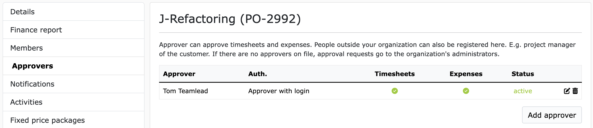

# Approver 

An approver is a person who approves times (timesheets) and/or expenses in a project.
An approver can be an employee of your company, but also an external freelancer or a customer.

!!! Tip
    If you are carrying out a project for a customer, then it is a good idea for the customer to approve the times and
    expenses that are posted to the customer project. In that case, you would add an employee of the
    customer to the project as an approver. 

## Add Approver

To add an approver, navigate to the project where you want to add the approver.
In the side menu on the left, click on "Approver". Here you can see all the approvers that have already been
added to the project and also add new approvers.

To add a new approver, click on "Add approver". 
A form will then open in which you can enter the approver's data. 
As shown in the example here with Max Mustermann:

### Existing approvers

There are two subheadings on the page: "Existing approvers" and "Add approver".
**"Existing approvers"** lists all users who have ever been entered as approvers in your organization.
These existing approvers are organized by email domains.
If you select a domain, the dropdown menu to the right of it will be filled with the corresponding approvers from the domain.
If you select an existing approver from the dropdown menu, the fields in the form will automatically be filled with the approver's data.
This function is very useful if you want to enter the same approver in several projects.

### Add approver

All fields below **"Add approver"** are required. Of course, we need the first name, last name and email address of the approver.
This information is also used on the timesheets to show who approved the timesheet.

With the first two checkboxes you can control what the approver can approve.
For example, timesheets and/or expenses.
In larger organizations in particular, it is common for timesheets to be approved by the specialist department and expenses/expenses by accounting.
In this case, you would enter two approvers with different permissions.

With the following checkboxes for Monday to Friday, you can control on which days of the week the approver should receive a reminder email for outstanding timesheets/expenses.

At the very bottom of the form are the radio buttons for the type of approver. There are basically two types of approvers:

- Approver with login

- Approver without login

More about these two types of approvers below.

After you have filled in all the fields, click "Save". The approver is then added to the project and receives an email notification about it.

If a project member now submits a timesheet for approval, all approvers of the project
who are allowed to approve timesheets will receive an email notification about it, with a link
to the timesheet.
The approvers can then view all the details of the timesheet on the timesheet page and can then comment, approve or reject it.

The approval of expenses works in the same way as the approval of timesheets.

Depending on the configuration, the approval of a timesheet can trigger further automated processes. Such as the generation of an outgoing invoice or a credit note.

## Email reminders

When a new timesheet/issue is submitted, all registered approvers in the project are immediately notified by email.
The email contains a link to the timesheet/expense that still needs to be approved.
Regardless of the first notification, reminder emails can also be set for each approver.
For each approver in the project, you can configure which days of the week the approver should receive a reminder email.
The reminder emails will then always be sent at 06:22 UTC on the respective day.

To configure this, navigate to the approvers in the project and click "Edit" for the desired approver.
Here you can then select the days of the week on which the approver should receive a reminder email.

You can set the default setting for these checkboxes in the organization settings under "Approver".

## Approver with login

An approver with login is a person who has their own user account in ZEIT.IO. 
This means that this person can log in to ZEIT.IO with a username and password and then has access to the platform.

If you select this option and then click "Save", it will be checked whether there is already a ZEIT.IO user with the specified email address.
If so, the user will be added to the project as an approver and will receive an email notification about it.
If there is no ZEIT.IO user with the specified email address yet, an invitation email will be sent to the email address and the person will be asked to register.
After registration, the user will then be added to the project as an approver.

### Advantages

Users who work as approvers have their own context ("approval mode").
In this context, approvers can view and approve all booked times, timesheets and expenses across all organizations for all projects where they are registered as approvers.

- The approver can view the booked project times here, even before a timesheet is submitted.
- The approver can view approved and rejected timesheets/expenses here at any time and thus has a history.
- The approver can see here at any time how many hours have already been booked on a project and how many hours can still be booked.
- **The identity of the approver is protected by a username and password!**

### Disadvantages

The approver needs a user account with ZEIT.IO. This means that the approver must register and
accept the terms and conditions and data protection regulations.

## Approver without login

Approver without login are people who do not have their own user account at ZEIT.IO.
If a project member submits a timesheet for approval, the "approver without login" will receive an email notification about it.
The email will then contain a unique link to the timesheet.
In this case, the link is assigned to this specific approver and timesheet and will only be sent by ZEIT.IO to this approver!
If two **approver without login** are registered in the project, then each approver will receive their own link to the timesheet.
The approver can then click on the link and view, comment on, approve or reject the timesheet.

### Advantages

- The approver does not need a user account at ZEIT.IO.
- The approver does not have to remember a username and password.
- The approver does not have to accept any terms and conditions or data protection regulations.

### Disadvantages

- The approver can only see the timesheet that was sent to him by email. The approver has no access to the platform and therefore cannot see any history.
- The approver cannot see the booked project times in advance.
- The approver cannot see the project budget in advance.
- **The identity of the approver is not protected by a username and password in this case.**

!!! warning
    Emails are sent unencrypted over the Internet by default. This means that emails can be read by third parties.

!!! warning
    The timesheet is publicly available on the Internet for a limited time. Anyone who knows the link to the timesheet can view the timesheet. The timesheet cannot be found via search engines, of course, but if the link is passed on, the timesheet can also be viewed, commented on, approved or rejected by third parties.
    **The identity of the approver is not protected by a user name and password in this case.**

## FAQs

### Can I add multiple approvers to a project?

Yes, you can add multiple approvers to a project.
This is actually "best practice".
In the event that an approver is unavailable, or is on vacation, or sick, or leaves the company, it is good to have a representative who can take over the approval.

### Can I change the approver permissions later?

Yes, you can change the approver permissions later.

### Can I remove an approver?

Yes, you can remove an approver from the project at any time.

### Can I add an approver to multiple projects?

Yes, you can add an approver to multiple projects.

### Do approvers see the hourly rates of the project members?

No, approvers do not see the hourly rates of the project members!
The hourly rates are only visible to certain members of the organization who have the rights to do so.

### Do approvers see the purchase and sales prices of the project members?

No, approvers see neither the purchase nor the sales prices of the project members!
The purchase and sales prices are only visible to certain members of the organization who have the rights to do so.

### What data does an approver see on the timesheet?

An approver sees all the data that the project member has entered on the timesheet. This is usually:

- Project name / activity
- Project number
- Date
- Start and end time of a time entry
- Duration of a time entry
- Activity description
