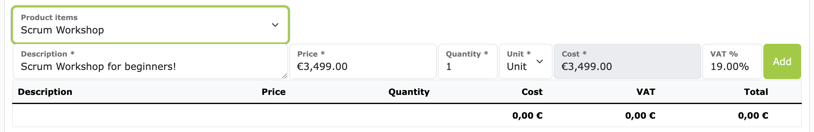

# Invoice items

Invoice items are the individual items that are listed on an invoice.
At ZEIT.IO you can create and manage invoice items, independent of the invoice.
When creating an invoice, existing items can then be selected and added.
This is particularly useful if you regularly have the same items on your invoices.

## Create & manage invoice items

To create a new invoice item, simply navigate to "Invoices -> Items" in the main menu.
Here you will see a list of all existing invoice items.
You can add a new item using the green "Create new item" button.
An item consists of the following fields:

- **Identifier**: A unique name for the item. This must be unique within the organization.
- **Description**: The description of the item as it should appear on the invoice.
- **Unit**: The unit in which the item is billed. E.g. piece, day, hour, etc.
- **Price**: The price per unit of the item.
- **Category**: A category into which the item can be classified.

## Use invoice items on invoices

If invoice items exist in the organization, an additional selection field for "Product items" appears when the invoice is created.
The dropdown contains the list of all existing item identifiers. Outlined in green in the screenshot:

If you select an item identifier, the input line below is filled with the values of the product item.

You can then adjust the number of units that should be billed on the invoice.
This way you can create invoices quickly and easily without having to re-enter the same items each time.
