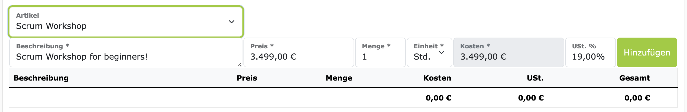

# Rechnungs-Artikel

Rechnungs-Artikel sind die einzelnen Positionen, die auf einer Rechnung aufgeführt werden.
Bei ZEIT.IO können Sie Rechnungs-Artikel erstellen und verwalten, unabhängig von der Rechnung.
Bei der Rechnungserstellung können dann bestehende Artikel ausgewählt und hinzugefügt werden.
Dies ist besonders praktisch, wenn Sie regelmäßig die gleichen Positionen auf Ihren Rechnungen haben.

## Rechnungs-Artikel erstellen & verwalten

Um einen neuen Rechnungs-Artikel zu erstellen, navigieren Sie einfach im Hauptmenü zu "Rechnungen -> Artikel".
Hier sehen Sie eine Liste aller bestehenden Rechnungs-Artikel.
Mit dem grünen Button "Neuen Artikel anlegen" können Sie einen neuen Artikel hinzufügen.
Ein Artikel besteht aus folgenden Feldern:

- **Kennung**: Ein eindeutiger Name für den Artikel. Dieser muss eindeutig innerhalb der Organisation sein.
- **Beschreibung**: Die Beschreibung des Artikels, wie sie auf der Rechnung auftauchen soll.
- **Einheit**: Die Einheit, in der der Artikel abgerechnet wird. Z.B. Stück, Tag, Stunde, etc.
- **Preis**: Der Preis pro Einheit des Artikels.
- **Kategorie**: Eine Kategorie, in die der Artikel eingeordnet werden kann.

## Rechnungs-Artikel auf Rechnungen verwenden

Wenn Rechnungs-Artikel in der Organisation vorhanden sind, dann erscheint bei der Rechnungserstellung ein zusätzliches Auswahlfeld für "Artikel".
Das Auswahlfeld enthält die Liste aller bestehenden Artikel-Kennungen. Im Screenshot grün umrandet:

Wenn Sie eine Artikel-Kennung auswählen, dann wird die darunterliegende Eingabezeile mit den Werten des Artikels befüllt.
Sie können dann noch die Anzahl der Einheiten anpassen, die auf der Rechnung abgerechnet werden sollen.
So können Sie schnell und einfach Rechnungen erstellen, ohne jedes Mal die gleichen Positionen neu eingeben zu müssen.
