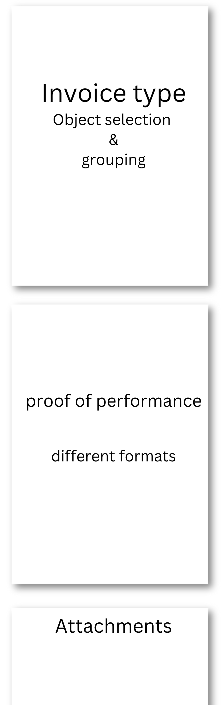

# Outgoing invoices

You can create and send your invoices in the outgoing invoices section.
To do this, click on "Invoices" in the main menu and then on "Outgoing invoices".
There you will see a list of all invoices that have already been created.
New invoices can either be created manually, 
or automatically using the [Auto-invoicing feature](/organisationen/auto-invoicing.en/).

## Invoice structure

A ZEIT.IO invoice consists of the following three elements:

- **Invoice type**: The actual invoice. The invoice type determines the selection and grouping of objects (time records, proof of performance, etc.) on the invoice. There are various invoice types, which are documented here: [Invoice types](#invoice-types).
- **Proof of performance**: The proof of performance is an optional and special attachment to the invoice, which usually contains a list of times or expenses. There are various proof of performance formats, which are documented here: [Proof of performance](#proof-of-performance-timesheets).
- **Attachments**: Other optional attachments to the invoice. More about this here: [Attachments](#attachments).

{ width=50% }


## Create new invoice

To create a new invoice, click on the "Create new invoice" button.
Next, you can select the invoice type and enter the invoice information.

## Invoice types

If you click on "Create new invoice" in the invoice outbox, you can select an invoice type.
The invoice type determines how the invoice is created and what information appears on the invoice.
Most invoice types are intended to bill time records, performance records, or other
billable objects. The invoice types are documented below:

### Standard

The "Standard" invoice type is the simplest invoice type and has no reference to time records, performance records, or other objects in ZEIT.IO.
With this invoice type, you can simply put any items on the invoice and bill them.

### 1 performance record

If you select the "1 performance record" invoice type, a dropdown menu will appear in the invoice module,
with all performance records that have not yet been billed. You then simply select a performance record,
and all times from the performance record are placed on the invoice.
If the performance record contains times with different hourly or daily rates, then the times are grouped by hourly or daily rate on the invoice.
If the performance record contains, for example, 20 hours with a remote hourly rate and 10 hours with an onsite hourly rate, then two items are generated for the invoice.
When the invoice is completed, the performance record is marked as billed and can no longer be used for another invoice.
This also ensures that times are not billed twice.

### N performance records
The invoice type "N performance records" works very similarly to "1 performance record".
The only difference is that you can bill multiple performance records from one project at once.

### 1 project
If you select the invoice type "1 project", a form initially appears in which you can select a start and end date and a project. All approved times from the project that fall within the period are then placed on the invoice and grouped according to the various hourly rates.
The names of the experts who booked the times do not appear on the invoice!

### 1 project - 1 expert

The invoice type "1 project - 1 expert" is very similar to "1 project".
The difference here is that you also select an expert who provided the service.

All approved times of the expert from the project that fall within the period are then placed on the invoice and grouped according to the various hourly rates.
The name of the expert appears on the invoice.

### 1 project grouped by experts

The invoice type "1 project grouped by experts" is very similar to "1 project".
The difference here is that the times are primarily grouped by experts, and the names of the experts also appear in the invoice items.

### 1 project grouped by activities

The invoice type "1 project grouped by activities" is very similar to "1 project".
The difference here is that the times are primarily grouped by activities and the activities also appear in the invoice items.


## Proof of performance (Timesheets)

If project times are billed with the invoice, then a proof of performance can optionally be selected
which contains the billed times. The proof of performance is then added as an attachment to the invoice.

There are various formats that you can choose for this proof of performance attachment:

### No proof of performance

With this option, no proof of performance is added to the invoice.

### Timesheet PDF attachment

If the invoice is of the type "Timesheet" (proof of performance) and the timesheet has a PDF attachment,
then the PDF from the timesheet is attached to the invoice. This option is particularly useful for
external proof of performance that was not created in ZEIT.IO. Read also
- [Get external performance proof approved](/freiberufler/leistungsnachweise.en/#have-external-proof-of-performance-approved).

### ZEIT.IO proof of performance (grouped by user)

The standard ZEIT.IO proof of performance is attached to the invoice. This contains a table with all approved time records for the selected period.
The entries include: 

 - date 
 - start & stop times 
 - project/activity 
 - comment 
 - name of the expert/user 
 - duration of the booking.

The time records are grouped by expert/user.
The performance records of the individual users are separated by page breaks.

### ZEIT.IO proof of performance (grouped by activity)

If activities are present, the first thing that is displayed is a table in which the booked times are grouped by activities.
A table with all approved time records for the selected period is then rendered. The entries include the date, start and stop times, project/activity, name of the expert/user, as well as comments and duration of the booking.

### Conti performance record

The Conti performance record is attached to the invoice.
This performance record complies with Continental Automotive's specifications.
DevUnits are used as the unit of measurement. 1 DevUnit = 1 hour. The DevUnits are grouped by activities.

### Dacuro performance record

This performance record contains a table with all approved time records for the selected period.
The entries include the date, project/activity, comments and duration of the booking.
Not included are start and stop times and the names of the experts/users.
If there are activities, the first thing that is displayed is a table in which the booked times are grouped by activities.
Since this performance record contains neither start nor stop times, entries with the same date and the same comment can be confusing. 
Therefore, entries with the same date and the same comment are summarized and the duration is added.


## Attachments

When you create an invoice, you can also add attachments. You can upload multiple PDF files
and these are then merged with the created invoice PDF. This means you receive a PDF invoice with
all the necessary attachments in a single file.


## Invoice formats

ZEIT.IO supports various invoice formats that can be selected during invoice creation.
The supported invoice formats are documented here:

- **PDF/A-3 without XML**: This option creates a normal PDF invoice that can be read by humans. The invoice data is not included in a structured form and cannot be automatically imported into your accounting software. This is not an e-invoice!
- **ZUGFeRD - Hybrid Invoice - PDF/A-3 + XML (EN 16931)**: This is a hybrid invoice format consisting of a PDF/A-3 file and an XML file, with the XML file embedded in the PDF. The XML contains all invoice data in a structured form and complies with the ZUGFeRD standard for electronic invoices. This option implements the ZUGFeRD profile "EN 16931" and is therefore compliant with the EU standard EN 16931.
- **ZUGFeRD - Hybrid Invoice - PDF/A-3 + XML (XRechnung)**: This is a hybrid invoice format consisting of a PDF/A-3 file and an XML file, with the XML file embedded in the PDF. The XML contains all invoice data in a structured form and complies with the ZUGFeRD standard for electronic invoices. This option implements the ZUGFeRD profile "XRechnung" and is also compliant with the EU standard EN 16931.
- **Factur-X - XML Invoice (EN 16931)**: This format is a pure XML invoice that contains all invoice data in a structured form. The XML file complies with the ZUGFeRD/Factur-X standard for electronic invoices and implements the ZUGFeRD profile "EN 16931". This option is also compliant with the EU standard EN 16931.
- **XRechnung - XML invoice (CII)**: This format is a pure XML invoice that contains all invoice data in a structured form. The XML file corresponds to the German XRechnung standard for electronic invoices. This option is also compliant with the EU standard EN 16931.

The invoice format **ZUGFeRD - Hybrid invoice - PDF/A-3 + XML (EN 16931)** is preselected by default.
You can also configure the invoice format directly in the customer object. The invoice format is then automatically applied to all invoices for this customer.
This saves time and reduces errors. 


## Article units

On an e-invoice according to EN 16931, only units that are defined in the code list [UN/ECE rec 20](https://www.xrepository.de/details/urn:xoev-de:kosit:codeliste:rec20_1) may be used.
The code list in question contains a four-digit number of units that may be used in the invoice.
In the ZEIT.IO invoice module, there is a drop-down menu for the unit with a preselection.
Since we do not want to ask our customers to go through the entire code list, we have preselected the most frequently used units.
The list of preselected units is documented here:

| Einheit/Label | Code | Beschreibung     |
|---------------|------|------------------|
| **Std.**      | HUR  | Stunde           |
| **PT**        | DAY  | Tag              |
| **Woche**     | WEE  | Woche            |
| **Monat**     | MON  | Monat            |
| **LE**        | HUR  | Leistungseinheit |
| **Stk.**      | H87  | Stück            |
| **Unit**      | C62  | Unit/Einheit     |
| **Lump sum**  | LS   | Lump sum         |
| **Km**        | KMT  | Kilometer        |
| **Kg**        | KGM  | Kilogramm        |
| **m**         | MTR  | Meter            |
| **m²**        | MTQ  | Quadratmeter     |
| **m³**        | MTK  | Kubikmeter       |
| **L**         | LTR  | Liter            |
| **T**         | TNE  | Tonne            |


## Tax categories

On an e-invoice according to EN 16931, each item must be assigned to a tax category.
The permitted tax categories are explained here:

- **S: Standard VAT rate**: This tax category corresponds to the standard VAT. If this category is selected, then a tax rate greater than 0 must be shown!
- **Z: Zero VAT rate**: This category must be selected if no taxes are due on the item in question. This case does not apply to France, where there is no 0 percent VAT rate.
- **E: VAT exempt**: This code must be used if no other case for missing VAT applies. The reason for the tax exemption must be stated in the VAT statement with reference to the applicable tax regulation.
- **AE: Inversion tax**: This applies where the customer has to declare the VAT and pay it directly to the tax authorities (normally they deduct the same VAT at the same time). The reason for the exemption must be indicated as "inversion" in the VAT breakdown.
- **K: Inversion for intra-community supply**: This is the same inversion procedure as before, but due to an intra-community supply. Therefore, the code "K" must be used instead of "AE". The reason for the absence of VAT to be indicated in the VAT statement is "intra-community supply".
- **G: VAT exempt**: This VAT code is used for supplies to countries outside the European Community.
- **O: Outside the scope of VAT**: In such a case, no other VAT categories may be indicated on the invoice.
- **L (IGIC) and M (IPSI): VAT codes for the Canary Islands and Ceuta/Melilla.**: These codes must be used for the Canary Islands and Ceuta/Melilla. The recipient's VAT number must be indicated on the invoice. This code is not applicable to France or Germany.


## CSV Export

Below the table on the right-hand side there is a link "CSV Export".
With this link you can download the current table for the outgoing invoices as a CSV file.

Each outgoing invoice is shown as a line in the CSV file.

The outgoing invoices can be filtered according to various criteria.
The CSV file contains the results of the current filter settings.

## DATEV CSV Export

If you filter the outgoing invoices according to a service month or year, an additional link "DATEV CSV Export" appears below the table on the right-hand side.
With this link you can download the current table for the outgoing invoices as a DATEV CSV file.
The DATEV CSV file contains all the outgoing invoices that were created in the selected service month or year.
Every single item on the outgoing invoice is shown as a line in the CSV file.
The file can therefore also contain more lines than the table on the website.

The file corresponds to the [DATEV booking stack format](https://developer.datev.de/datev/platform/de/dtvf/formate/buchungsstapel) and contains all the necessary information for accounting.
The DATEV CSV file can then be imported into your accounting software.

## FAQs

### Which email address are the invoices sent from?

By default, the invoices are sent from the email address `noreply@zeit.io`.
This email is also protected by SPF and DKIM.
The name of your organization always appears as the sender name. Like here, for example:

```
Muster-Organisations GmbH <noreply@zeit.io>
```

To ensure that the invoices reach the recipient, you should still inform the recipients
that you are using ZEIT.IO as your new invoice creation tool and that future invoices will come from the email address `noreply@zeit.io`.

### How can I cancel an invoice?

An invoice can only be canceled if it has not yet been paid.
To do this, click on the invoice you want to cancel and then on "Cancel" under "Actions" at the top right.
