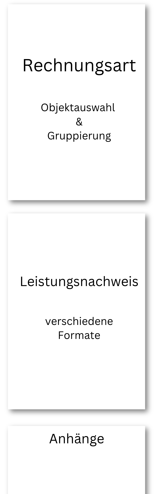

# Rechnungsausgang

Im Rechnungsausgang können Sie Ihre Rechnungen erstellen und versenden.
Dafür klicken Sie im Hauptmenü auf "Rechnungen" und dann auf "Rechnungsausgang".
Dort sehen Sie eine Liste aller Rechnungen, die bereits erstellt wurden.
Neue Rechnungen können entweder manuell erstellt werden, 
oder automatisch über das [Auto-Ausgangsrechnungen Feature](/organisationen/auto-invoicing/).

## Rechnungsaufbau 

Eine ZEIT.IO Rechnung besteht aus folgenden drei Elementen:

- **Rechnungsart**: Die eigentliche Rechnung. Die Rechnungsart bestimmt die Auswahl und Gruppierung von Objekten (TimeRecords, Leistungsnachweise, etc.) auf der Rechnung. Es gibt verschiedene Rechnungsarten, die hier dokumentiert sind: [Rechnungsarten](#rechnungsarten).
- **Leistungsnachweis**: Der Leistungsnachweis ist ein optionaler und spezieller Anhang zur Rechnung, der meistens eine Auflistung von Zeiten oder Ausgaben enthält. Es gibt verschiedene Leistungsnachweis-Formate, die hier dokumentiert sind: [Leistungsnachweise](#leistungsnachweise).  
- **Anhänge**: Weitere optionale Anhänge zur Rechnung. Mehr dazu hier: [Anhänge](#anhange).

{ width=50% }

## Neue Rechnung erstellen

Um eine neue Rechnung zu erstellen, klicken Sie auf den Button "Neue Rechnung erstellen". 
Als nächstes können Sie die Rechnungsart auswählen und die Rechnungsinformationen eingeben.

## Rechnungsarten 

Wenn Sie im Rechnungsausgang auf "Neue Rechnung erstellen" klicken, dann können Sie eine Rechnungsart auswählen.
Die Rechnungsart bestimmt, wie die Rechnung erstellt wird und welche Informationen auf der Rechnung erscheinen.
Die meisten Rechnungsarten sind dafür gedacht, um TimeRecords, Leistungsnachweise, oder andere 
abrechnungsfähige Objekte abzurechnen. Die Rechnungsarten sind hier nachfolgend dokumentiert:

### Standard

Die Rechnungsart "Standard" ist die einfachste Rechnungsart und hat keinen Bezug zu TimeRecords, Leistungsnachweisen oder anderen Objekten in ZEIT.IO.
Bei dieser Rechnungsart können Sie einfach beliebige Positionen auf die Rechnung setzen und diese abrechnen.

### 1 Leistungsnachweis

Wenn Sie die Rechnungsart "1 Leistungsnachweis" auswählen, dann erscheint im Rechnungsmodul ein Dropdown-Menü, 
mit allen Leistungsnachweisen, die noch nicht abgerechnet wurden. Sie wählen dann einfach einen Leistungsnachweis aus,
und alle Zeiten aus dem Leistungsnachweis werden auf die Rechnung gesetzt. 
Wenn der Leistungsnachweis Zeiten mit verschiedenen Stunden- oder Tagessätzen enthält, dann werden die Zeiten gruppiert nach Stunden- oder Tagessatz auf der Rechnung dargestellt.
Wenn der Leistungsnachweis z.B. 20 Stunden mit einem Remote-Stundensatz und 10 Stunden mit einem Onsite-Stundensatz enthält, dann werden zwei Positionen generiert für die Rechnung.

Wenn die Rechnung abgeschlossen wird, dann wird der Leistungsnachweis als abgerechnet markiert und kann nicht mehr für eine weitere Rechnung verwendet werden.
Damit wird auch sichergestellt, dass Zeiten nicht doppelt abgerechnet werden. 

### N Leistungsnachweise

Die Rechnungsart "N Leistungsnachweise" funktioniert sehr ähnlich zu "1 Leistungsnachweis". 
Nur dass Sie hier mehrere Leistungsnachweise aus einem Projekt auf einmal abrechnen können.

### 1 Projekt

Wenn Sie die Rechnungsart "1 Projekt" auswählen, dann erscheint initial ein Formular, in dem Sie ein Start- und Enddatum und ein Projekt auswählen können.
Alle genehmigten Zeiten aus dem Projekt, die in dem Zeitraum liegen, werden dann auf die Rechnung gesetzt und nach den verschiedenen Stundensätzen gruppiert.
Die Namen der Experten, welche die Zeiten gebucht haben, erscheinen nicht auf der Rechnung! 

### 1 Projekt - 1 Experte

Die Rechnungsart "1 Projekt - 1 Experte" ist sehr ähnlich zu "1 Projekt". 
Der Unterschied hier ist, dass Sie zusätzlich noch einen Experten auswählen, der die Leistung erbracht hat.
Alle genehmigten Zeiten des Experten aus dem Projekt, die in dem Zeitraum liegen, werden dann auf die Rechnung gesetzt und nach den verschiedenen Stundensätzen gruppiert.
Der Name des Experten erscheint auf der Rechnung.

### 1 Projekt gruppiert bei Experten

Die Rechnungsart "1 Projekt gruppiert bei Experten" ist sehr ähnlich zu "1 Projekt".
Der Unterschied hier ist, dass die Zeiten in erster Linie nach Experten gruppiert werden, die Namen der Experten auch in den Rechnungspositionen auftauchen.

### 1 Projekt gruppiert bei Aktivitäten

Die Rechnungsart "1 Projekt gruppiert bei Aktivitäten" ist sehr ähnlich zu "1 Projekt".
Der Unterschied hier ist, dass die Zeiten in erster Linie nach Aktivitäten gruppiert werden und die Aktivitäten auch in den Rechnungspositionen auftauchen.


## Leistungsnachweise

Wenn mir der Rechnung Projektzeiten abgerechnet werden, dann kann optional ein Leistungsnachweis ausgewählt werden,
welcher die abgerechneten Zeiten enthält. Der Leistungsnachweis wird dann als Anhang zur Rechnung hinzugefügt.
Für diesen Leistungsnachweis-Anhang gibt es verschieden Formate, die Sie auswählen können:

### Kein Leistungsnachweis

Bei dieser Option wird kein Leistungsnachweis zur Rechnung hinzugefügt.

### Timesheet PDF Anhang

Wenn die Rechnung vom Type "Timesheet" (Leistungsnachweis) ist, und das Timesheet einen PDF-Anhang hat,
dann wird die PDF aus dem Timesheet an die Rechnung angehängt. Diese Option macht vor allem Sinn, für
externe Leistungsnachweise, die nicht in ZEIT.IO erstellt wurden. Lesen hierzu auch
- [Externen Leistungsnachweis genehmigen lassen](/freiberufler/leistungsnachweise/#externen-leistungsnachweis-genehmigen-lassen).

### ZEIT.IO Leistungsnachweis (Gruppiert bei Benutzer)

Der Standard-ZEIT.IO-Leistungsnachweis wird an die Rechnung angehängt. Dieser enthält eine Tabelle mit allen genehmigten TimeRecords für den ausgewählten Zeitraum.
Die Einträge beinhalten:

- Datum
- Start- & Stopzeiten
- Projekt/Aktivität
- Kommentar
- Name des Experten/Benutzers
- Dauer der Buchung.

Die TimeRecords sind gruppiert nach Experten/Benutzer.
Die Leistungsnachweise der einzelnen Benutzer sind getrennt durch Seitenumbruch.

### ZEIT.IO Leistungsnachweis (Gruppiert bei Aktivität)

Wenn Aktivitäten vorhanden sind, dann wird als aller erstes eine Tabelle eingeblendet, bei der die gebuchten Zeiten nach Aktivitäten gruppiert sind.
Anschließend wird eine Tabelle mit allen genehmigten TimeRecords für den ausgewählten Zeitraum gerenderd.
Die Einträge beinhalten Datum, Start- & Stopzeiten, Projekt/Aktivität, Name des Experten/Benutzers, sowie Kommentar und Dauer der Buchung.

### Conti Leistungsnachweis

Es wird der Conti-Leistungsnachweis an die Rechnung angehängt.
Dieser Leistungsnachweis entspricht den Vorgaben von Continental Automotive.
Als Messeinheit werden DevUnits verwendet. 1 DevUnit = 1 Std. Die DevUnits sind gruppiert nach Aktivitäten.

### Dacuro Leistungsnachweis

Dieser Leistungsnachweis enthält eine Tabelle mit allen genehmigten TimeRecords für den ausgewählten Zeitraum.
Die Einträge beinhalten Datum, Projekt/Aktivität, Kommentar und Dauer der Buchung.
Nicht enthalten sind Start- Stoppzeiten und die Namen der Experten/Benutzer.
Wenn Aktivitäten vorhanden sind, dann wird als aller erstes eine Tabelle eingeblendet, bei der die gebuchten Zeiten nach Aktivitäten gruppiert sind.
Da dieser Leistungsnachweis weder Start- noch Stoppzeiten enthält, können Einträge mit gleichem Datum und gleichem Kommentar verwirrend sein.
Deshalb werden Einträge mit gleichem Datum und gleichem Kommentar zusammengefasst und die Dauer addiert.


## Anhänge  

Wenn Sie eine Rechnung erstellen, können Sie auch Anhänge hinzufügen. Sie können mehrere PDF-Dateien hochladen 
und diese werden dann mit der erstellten Rechnungs-PDF zusammengefügt. Somit erhalten Sie eine PDF-Rechnung mit
allen notwendigen Anhängen, in einer einzelnen Datei.


## Rechnungsformate 

ZEIT.IO unterstützt verschiedene Rechnungsformate, die während der Rechnungserstellung ausgewählt werden können.
Hier sind die unterstützten Rechnungsformate dokumentiert:

 - **PDF/A-3 ohne XML**: Bei dieser Option wird eine normale PDF-Rechnung erstellt, die von Menschen gelesen werden kann. Die Rechnungsdaten sind nicht in strukturierter Form enthalten und können nicht automatisch in Ihre Buchhaltungssoftware importiert werden. Hierbei handelt es sich nicht um eine E-Rechnung!
 - **ZUGFeRD - Hybride Rechnung - PDF/A-3 + XML (EN 16931)**: Dies ist ein hybrides Rechnungsformat, bestehend aus einer PDF/A-3 Datei und einer XML Datei, wobei die XML-Datei in die PDF eingebettet ist. Die XML enthält alle Rechnungsdaten in strukturierter Form und entspricht dem ZUGFeRD Standard für elektronische Rechnungen. Diese Option implementiert das ZUGFeRD Profil "EN 16931" und ist somit konform zur EU Norm EN 16931.
 - **ZUGFeRD - Hybride Rechnung - PDF/A-3 + XML (XRechnung)**: Dies ist ein hybrides Rechnungsformat, bestehend aus einer PDF/A-3 Datei und einer XML Datei, wobei die XML-Datei in die PDF eingebettet ist. Die XML enthält alle Rechnungsdaten in strukturierter Form und entspricht dem ZUGFeRD Standard für elektronische Rechnungen. Diese Option implementiert das ZUGFeRD Profil "XRechnung" und ist ebenfalls konform zur EU Norm EN 16931.
 - **Factur-X - XML Rechnung (EN 16931)**: Dieses Format ist eine reine XML-Rechnung, die alle Rechnungsdaten in strukturierter Form enthält. Die XML-Datei entspricht dem ZUGFeRD/Factur-X Standard für elektronische Rechnungen und implementiert das ZUGFeRD Profil "EN 16931". Diese Option ist ebenfalls konform zur EU Norm EN 16931.
 - **XRechnung - XML Rechnung (CII)**: Dieses Format ist eine reine XML-Rechnung, die alle Rechnungsdaten in strukturierter Form enthält. Die XML-Datei entspricht dem deutschen XRechnung Standard für elektronische Rechnungen. Diese Option ist ebenfalls konform zur EU Norm EN 16931.

Standardmäßig ist das Rechnungsformat **ZUGFeRD - Hybride Rechnung - PDF/A-3 + XML (EN 16931)** vorausgewählt.
Sie können das Rechnungsformat auch direkt bei Kunden-Objekt konfigurieren. Dann wird das Rechnungsformat automatisch für alle Rechnungen dieses Kunden übernommen.
Das spart Zeit und reduziert Fehler.


## Artikel-Einheiten

Auf einer E-Rechnung nach EN 16931 dürfen nur Einheiten verwendet werden, die auf der Codeliste [UN/ECE rec 20](https://www.xrepository.de/details/urn:xoev-de:kosit:codeliste:rec20_1) definiert sind.
Die besagte Codeliste enthält eine vierstellige Anzahl von Einheiten, die in der Rechnung verwendet werden dürfen.
Im Rechnungsmodul von ZEIT.IO, gibt es für die Einheit ein Dropdown-Menü, mit einer Vorauswahl.
Da wir unseren Kunden nicht zumuten wollen, die gesamte Codeliste durchzugehen, haben wir die am häufigsten verwendeten Einheiten vorausgewählt.
Hier ist die Liste der vorausgewählten Einheiten dokumentiert:

| Einheit/Label | Code | Beschreibung     |
|---------------|------|------------------|
| **Std.**      | HUR  | Stunde           |
| **PT**        | DAY  | Tag              |
| **Woche**     | WEE  | Woche            |
| **Monat**     | MON  | Monat            |
| **LE**        | HUR  | Leistungseinheit |
| **Stk.**      | H87  | Stück            |
| **Unit**      | C62  | Unit/Einheit     |
| **Pauschal**  | LS   | Pauschalbetrag   |
| **Km**        | KMT  | Kilometer        |
| **Kg**        | KGM  | Kilogramm        |
| **m**         | MTR  | Meter            |
| **m²**        | MTQ  | Quadratmeter     |
| **m³**        | MTK  | Kubikmeter       |
| **L**         | LTR  | Liter            |
| **T**         | TNE  | Tonne            |


## CSV Export

Unterhalb der Tabelle auf der rechten Seite gibt es einen Link "CSV Export".
Mit diesem Link können Sie die aktuelle Tabelle für die Ausgangsrechnungen als CSV Datei herunterladen.
Jede Ausgangsrechnung wird als eine Zeile in der CSV Datei dargestellt.

Die Ausgangsrechnungen können nach verschiedenen Kriterien gefiltert werden.
Die CSV Datei enthält die Ergebnismenge der aktuellen Filtereinstellungen.

## DATEV CSV Export

Wenn Sie die Ausgangsrechnungen nach einem Leistungs-Monat oder Jahr filtern, dann erscheint unterhalb der Tabelle, auf der rechten Seite, ein zusätzlicher Link "DATEV CSV Export".
Mit diesem Link können Sie die aktuelle Tabelle für die Ausgangsrechnungen als DATEV CSV Datei herunterladen.
Die DATEV CSV Datei enthält alle Ausgangsrechnungen, die in dem gewählten Leistungs-Monat oder Jahr erstellt wurden.
Jede einzelne Position auf der Ausgangsrechnung wird als eine Zeile in der CSV Datei dargestellt.
Deshalb kann die Datei auch mehr Zeilen enthalten als die Tabelle auf der Webseite.

Die Datei entspricht dem [DATEV Buchungsstapel Format](https://developer.datev.de/datev/platform/de/dtvf/formate/buchungsstapel) und enthält alle notwendigen Informationen für die Buchhaltung.
Die DATEV CSV Datei kann dann in Ihre Buchhaltungssoftware importiert werden.

## FAQs

### Von welcher E-Mail-Adresse werden die Rechnungen versendet?

Standardmäßig werden die Rechnungen von der E-Mail-Adresse `noreply@zeit.io` versendet. 
Diese E-Mail ist auch durch SPF und DKIM geschützt. 
Als Absendername erscheint immer der Name ihrer Organisation. Wie hier zum Beispiel:

```
Muster-Organisations GmbH <noreply@zeit.io>
```

Um sicherzustellen, dass die Rechnungen beim Empfänger ankommen, sollten Sie dennoch die Empfänger darüber informieren, 
dass Sie ZEIT.IO als neues Rechnungserstellungs-Tool verwenden und dass zukünftige Rechnungen von der E-Mail-Adresse `noreply@zeit.io` kommen werden.

### Wie kann ich eine Rechnung stornieren?

Eine Rechnung kann nur storniert werden, wenn sie noch nicht bezahlt wurde. 
Dafür klicken Sie auf die Rechnung, die Sie stornieren möchten, und dann bei den "Aktionen" rechts oben, auf "Stornieren".

