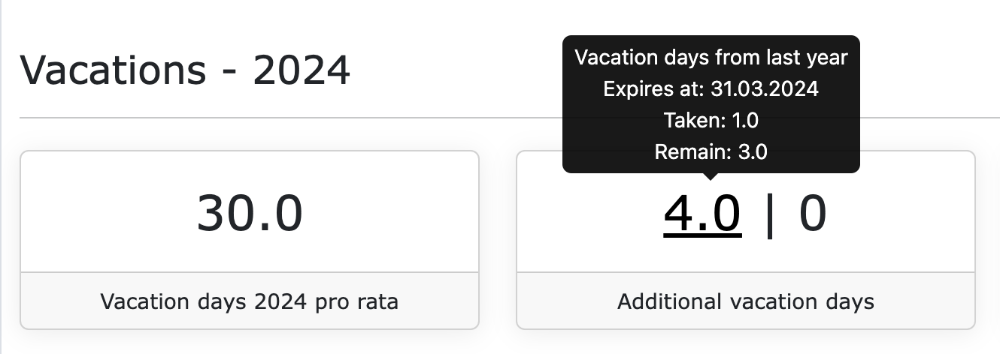

# Vacations 

.. coming soon .. 

## Transfer vacation days from last year

By default, the vacation days not taken from the last year are **not** automatically transferred to the 
new year.

If you want to allow your employees to transfer the vacation days not taken from the last year to the
new year, you can activate this in the settings of the respective employment contract. To do this, please
navigate, in the context of the organization, to the desired employee contract and then to the "Settings" tab.
In the "Vacation" section, there is a checkbox **"Vacation days not taken are transferred to the next year, until March 31."**.
If this option is activated, the vacation days not taken from the last year are transferred to the new year.
This happens automatically on January the 2nd of the new year. The transferred additional vacation days then have a
default expiration date until March 31 of the new year.

## Adjust expiration date for vacation days from last year

Vacation days from the last year, which were transferred to the new year, expire by default on March 31
of the new year. However, you can adjust the expiration date for the transferred vacation days. 
To do this, please navigate, in the context of the organization, to the desired employee contract and then to
the "Working hours" tab. In the "Vacations" section, in the second tile, you will see the number
of vacation days transferred from the last year.

This number is clickable. If you click on the number, a form will open in which you can adjust the
expiration date for the transferred vacation days.

Here you can select an expiration date within the new year. The expiration date can be a maximum of
December 31 of the new year.
