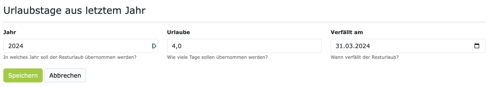

# Urlaube 

.. coming soon .. 

## Urlaubstage aus dem letzten Jahr übertragen

Standardmäßig werden die nicht genommenen Urlaubstage aus dem letzten Jahr **nicht** automatisch in das 
neue Jahr übertragen. Damit verfallen nicht genommene Urlaubstage am Jahresende! 

Wenn Sie Ihren Mitarbeitern erlauben möchten, nicht genommene Urlaubstage aus dem letzten Jahr in das 
neue Jahr zu übertragen, dann können Sie das in den Einstellungen des jeweiligen Arbeitsvertrags 
aktivieren. Dafür navigieren Sie bitte, im Kontext der Organisation, zu dem gewünschten Mitarbeitervertrag 
und dann auf den Tab "Einstellungen". Bei der Sektion "Urlaub", gibt es eine Checkbox 
**"Nicht genommene Urlaubstage werden in das nächste Jahr übernommen, bis zum 31. März."**. Wenn diese
Option aktiviert ist, dann werden die nicht genommenen Urlaubstage aus dem letzten Jahr in das neue Jahr
übertragen. Dies geschieht automatisch am 2. Januar des neuen Jahres. Die so übertragenen zusatzlichen
Urlaubstage haben dann standardmäßig ein Verfallsdatum bis zum 31. März des neuen Jahres.

## Verfallsdatum für Urlaubstage aus dem letzten Jahr anpassen

Urlaubstage aus dem letzten Jahr, die in das neue Jahr übertragen wurden, verfallen standardmäßig am 31. März
des neuen Jahres. Sie können das Verfallsdatum für die übertragenen Urlaubstage allerdings anpassen. 
Dafür navigieren Sie bitte, im Kontext der Organisation, zu dem gewünschten Mitarbeitervertrag und dann auf
den Tab "Arbeitsstunden". Bei der Sektion "Urlaube", in der zweiten Kachel, sehen Sie die Anzahl 
der übertragenen Urlaubstage aus dem letzten Jahr.  

Diese Zahl ist anklickbar. Wenn Sie auf die Zahl drauf klicken, dann öffnet sich ein Formular, in dem Sie das
Verfallsdatum für die übertragenen Urlaubstage anpassen können. 

Hier können Sie ein Verfallsdatum innerhalb des neuen Jahres auswählen. Das Verfallsdatum kann maximal der
31. Dezember des neuen Jahres sein. 
